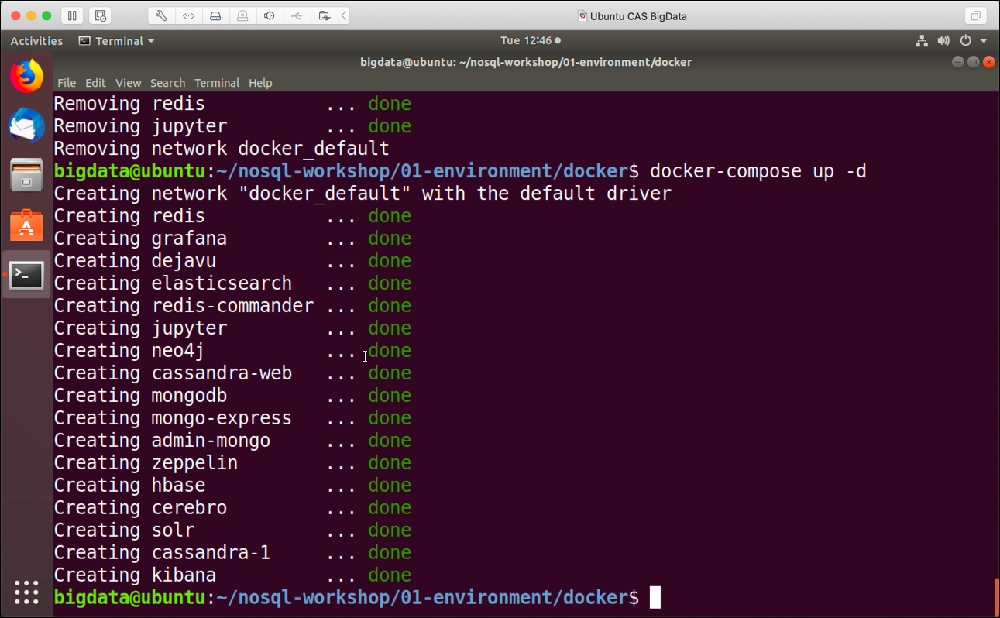

# Локальная среда виртуальной машины

Откройте и запустите виртуальную машину с помощью **VMWare Workstation** на Windows или **VMWare Fusion** на Mac или **Virtual Box**.

В настоящее время виртуальная машина настроена на использование **14** ГБ памяти. Если в вашей системе доступно менее 16 ГБ, обязательно уменьшите его перед запуском виртуальной машины, минимальный размер **4** ГБ.

## Подготовка среды

В виртуальной машине запустите окно терминала и выполните следующие команды.

Сначала давайте добавим переменные среды. Обязательно адаптируйте сетевой интерфейс (**ens33**) в соответствии с вашей средой. Вы можете получить имя интерфейса, используя **ipconfig** в Windwos или **ifconfig* в Mac/Linux.

```
# Подготовьте переменные среды
экспорт PUBLIC_IP=$(curl ipinfo.io/ip)
экспорт DOCKER_HOST_IP=$(ip addr show ens33 | grep "inet\b" | awk '{print $2}' | Cut -d/ -f1)
```

или

Если вы работаете только локально:

```
экспортировать PUBLIC_IP=локальный хост
экспортировать DOCKER_HOST_IP=127.0.0.1
```

Ubuntu 22/04

```
# Откройте файл .bashrc в текстовом редакторе
nano ~/.bashrc

# Добавьте эти строки в конец файла
export PUBLIC_IP=localhost
export DOCKER_HOST_IP=127.0.0.1

# Сохраните файл: 
# Ctrl + O, затем Enter для сохранения
# Ctrl + X для выхода из nano

# Примените изменения
source ~/.bashrc
```

Если вы знаете свой IP-адрес:

```
экспортировать PUBLIC_IP=ваш.public.ip
экспорт DOCKER_HOST_IP=ваш.локальный.ip

```

В некоторых случаях можно использовать определение IP-адреса в Docker-compose:

```
услуги:
 мойсервис:
 сети:
 - хозяин
```

Эти переменные важны, если:

- Настраивает распределенную систему.

- Работаете с Docker-контейнерами.

- Нужна связь между сервисами.

Требуется доступ извне.


Теперь, чтобы Elasticserach работал правильно, нужно увеличить параметр vm.max_map_count, как показано ниже.

```
# необходим для эластичного поиска
sudo sysctl -w vm.max_map_count=262144
```

Теперь давайте проверим проект NoSQL Workshop с github:

```
# Получить проект
компакт-диск /home/bigdata
судо РМ -Р nosql-workshop/
git clone https://github.com/BosenkoTM/nosql-workshop.git
cd nosql-workshop/01-environment/docker
```

## Запуск среды

И, наконец, давайте запустим среду:

```
# Убедитесь, что среда не запущена
sudo docker compose down

# Запуск среды
sudo docker compose up -d
```

Среда должна быть доступна сразу после установки всех контейнеров, так как все необходимые образы доступны в локальном реестре образов docker.

Вывод похож на тот, что приведен ниже.



Теперь  экземпляр готов к использованию. Выполните шаги после установки, описанные [здесь](README.md).

## Остановить среду

Чтобы остановить среду, выполните следующую команду:

```
sudo docker compose stop
```

после этого ее можно перезапустить с помощью `sudo docker compose start`.

Чтобы остановить и удалить все запущенные контейнеры, выполните следующую команду:

```
sudo docker compose down
```
