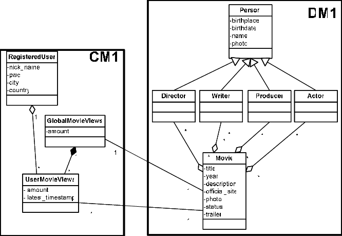

# NoSQL Platform on Docker

## Provisioning environment
The environment for this course is completely based on docker containers. 

In order to simplify the provisioning, a single docker-compose configuration is used. All the necessary software will be provisioned using Docker. 

You have the following options to start the environment:

 * [**Cloud Virtual Machine on Ubuntu with Init Script**](./CloudVM.md) - Use a cloud-based Virtual Machine running on Ubuntu and provide an Init script.
 * [**AWS Lightsail Environment**](./Lightsail.md) - AWS Lightsail is a service in Amazon Web Services (AWS) with which we can easily startup an environment and provide all the necessary bootstrapping as a script.
 * [**Local Virtual Machine Environment**](./LocalVirtualMachine.md) - a Virtual Machine with Docker and Docker Compose pre-installed will be distributed at by the course infrastructure. You will need 50 GB free disk space.
 * [**Local Docker Environment**](./LocalDocker.md) - you have a local Docker and Docker Compose setup in place which you want to use

## Services accessible on NoSQL Platform
The following service are available as part of the platform:

Product | Type | Service | Url
------|------| --------| ----
Redis | Development | Redis Commander | <http://localhost:28119>
Cassandra | Development | Cassandra-Web | <http://localhost:28200>
MongoDB | Management | Admin Mongo | <http://localhost:28204>
MongoDB | Development | Mongo-Express | <http://localhost:28203>
Elasticsearch | Development | Dejavu | <http://localhost:28205>
Elasticsearch | Development | cerebro | <http://localhost:28206>
Elasticsearch | Development | Kibana | <http://localhost:5601>
Elasticsearch | Development | ElasticHQ | <http://localhost:28207>
Neo4J | Development | Neo4J | <http://localhost:7474>
Grafana | Development | Grafana | <http://localhost:3000>
Zepplin | Development | Zeppelin | <http://localhost:28080>
Jupyter | Development | Jupyter | <http://localhost:28888>
Influx DB | Development | Chronograf | <http://localhost:28209>
Influx DB | Development | Influx UI | <http://localhost:28208>
Adminer | Development | PostgreSQL | <http://localhost:28210>
CAdvisor | Management | Docker | <http://localhost:28217>

## Workshop based on IMDb

For the workshop we are going to use data from [IMDb](https://www.imdb.com/). 

The following diagram shows the conceptual model of IMDb. 

The data has been downloaded using the following Jupyter notebook (link to be added). 
