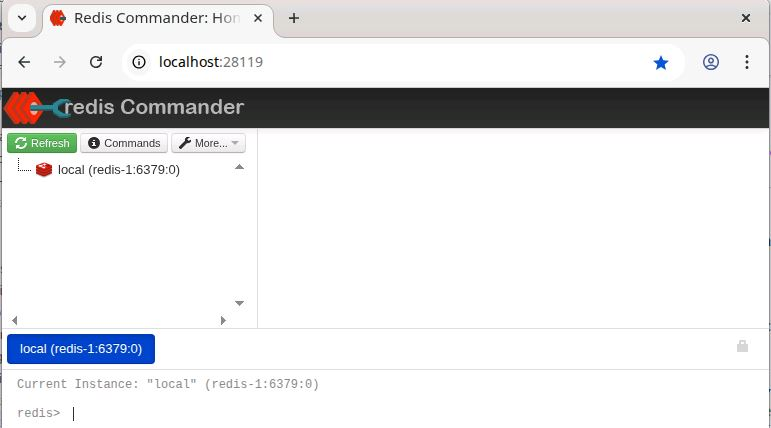

# Начало работы с Redis

В этом воркшопе изучим основы работы с Redis. Будем использовать `Docker` для инициализации `Redis` в контейнере.

## Использование утилиты командной строки Redis

Для подключения к `Redis` можно использовать либо утилиту командной строки `Redis`, либо браузерный `Redis Commander`.

### Использование утилиты командной строки Redis

Откройте еще одно окно терминала и введите следующую команду, чтобы запустить `Redis CLI` в другом docker-контейнере:

```bash
docker run -it --rm --network nosql-platform bitnami/redis redis-cli -h redis-1 -p 6379
```

Должен запуститься `Redis CLI` и появиться следующая командная строка (при этом IP-адрес может отличаться).

```bash
Unable to find image 'bitnami/redis:latest' locally
latest: Pulling from bitnami/redis
ce4f4d45406a: Pull complete 
Digest: sha256:25bf63f3caf75af4628c0dfcf39859ad1ac8abe135be85e99699f9637b16dc28
Status: Downloaded newer image for bitnami/redis:latest
redis 19:43:01.24 INFO  ==> 
redis 19:43:01.24 INFO  ==> Welcome to the Bitnami redis container
redis 19:43:01.25 INFO  ==> Subscribe to project updates by watching https://github.com/bitnami/containers
redis 19:43:01.25 INFO  ==> NOTICE: Starting August 28th, 2025, only a limited subset of images/charts will remain available for free. Backup will be available for some time at the 'Bitnami Legacy' repository. More info at https://github.com/bitnami/containers/issues/83267
redis 19:43:01.25 INFO  ==> 

redis-1:6379> 
```

Redis настроен так, что требует аутентификации. Вы можете использовать пользователя `default`, поэтому нужно передать только пароль с помощью команды `AUTH`.

```bash
AUTH abc123!
```

В случае появления:

```bash
ERR AUTH <password> called without any password configured for the default user означает, что сервер Redis, к которому вы подключились, не настроен на использование пароля.
```
сервер `Redis`, к которому подключились, не настроен на использование пароля.

Пропустите этот шаг. Не вводите команду `AUTH abc123!`.

Сразу после подключения через `Docker` вы уже находитесь в командной строке `Redis` и можете начать выполнять команды.

Для проверки соединения введите простую команду `PING`:

```bash
redis-1:6379> PING
```

Введите `help`, чтобы увидеть версию установленного `Redis`.

```bash
redis:6379> help
redis-cli 6.0.9
To get help about Redis commands type:
      "help @<group>" to get a list of commands in <group>
      "help <command>" for help on <command>
      "help <tab>" to get a list of possible help topics
      "quit" to exit

To set redis-cli preferences:
      ":set hints" enable online hints
      ":set nohints" disable online hints
Set your preferences in ~/.redisclirc
```

### Использование Redis Commander

В окне веб-браузера перейдите по адресу http://localhost:28119. Вы должны увидеть изображение, что показано ниже.



## Структура данных "Строка" (String)

Введите команды. Это можно сделать как с помощью `Redis CLI`, так и через `Redis Commander`.

```bash
help @string
```

### `help @string`

По сути, это главная шпаргалка по всем возможным действиям с простыми парами «ключ-значение» в `Redis`.

Эти команды можно условно разделить на несколько групп:

*   **Базовые операции:**
    *   `SET`: установить или перезаписать значение ключа.
    *   `GET`: получить значение по ключу.
    *   `DEL` (не в этом списке, но относится сюда): удалить ключ.

*   **Атомарные операции с числами:**
    *   `INCR`: увеличить числовое значение на 1.
    *   `DECR`: уменьшить числовое значение на 1.
    *   `INCRBY` / `DECRBY`: увеличить/уменьшить на заданное число.

*   **Массовые (атомарные) операции:**
    *   `MGET`: получить значения сразу нескольких ключей.
    *   `MSET`: установить значения сразу для нескольких ключей.

*   **Условные операции:**
    *   `SETNX`: установить значение, только если ключ еще не существует.

*   **Операции с частями строк:**
    *   `APPEND`: дописать строку в конец существующего значения.
    *   `GETRANGE`: получить часть (подстроку) из значения.

Этот список — основной инструмент для работы со строковыми данными в Redis.

###	Работа с ключами

`Redis` — это так называемое хранилище типа «ключ-значение», часто называемое `NoSQL` базой данных. Суть хранилища «ключ-значение» заключается в возможности сохранить некоторые данные, называемые значением, внутри ключа. Эти данные позже можно извлечь, только если мы знаем точный ключ, использованный для их сохранения.

Можно использовать команду `SET` для сохранения значения “redis-server” по ключу “server:name”:


```bash
SET server:name "redis-server"
```

`Redis` сохранит данные на постоянной основе, поэтому позже  можем спросить: «Какое значение хранится по ключу server:name?»

```bash
GET server:name 
```

и `Redis` ответит “redis-server”.

```bash
EXISTS server:name
(integer) 1
```

```bash
KEYS server*
1) "server:name"
```

```bash
KEYS *
1) "server:name"
```

### Операции Get и Set

Другие распространенные операции, предоставляемые хранилищами «ключ-значение», это `DEL` для удаления заданного ключа и связанного с ним значения, `SET-if-not-exists` (в Redis называется `SETNX`), которая устанавливает ключ, только если он еще не существует, и `INCR` для атомарного увеличения числа, хранящегося по заданному ключу. Давайте посмотрим на некоторые из этих команд в действии:

Сначала установим значение для ключа `connections` с помощью команды `SET`:

```bash
redis:6379> SET connections 10
OK
```

Проверим значение с помощью команды `GET`:

```bash
redis:6379> GET connections
"10"
```

Поробуем перезаписать его с помощью другой команды `SET`:

```bash
redis:6379> SET connections 20
OK
redis:6379> GET connections
"20"
```

Посмотрим, что произойдет, если использовать команду `SETNX`.

```bash
redis:6379> SETNX connections 30
(integer) 0
redis:6379> GET connections
"20"
```

Если  используем `SETNX` для ключа, который еще не существует, получим другой ответ:

```bash
redis:6379> SETNX newkey 30
(integer) 1
```

Используем `MSET` для установки нескольких пар «ключ-значение»...

```bash
redis:6379> MSET key1 10 key2 20 key3 30
(integer) 1
```

...и обратную команду `MGET`, чтобы получить несколько значений для нескольких ключей.

```bash
redis:6379> MGET key1 key3
1) "10"
2) "30"
```
**Примечание**: это сильно отличается от одиночных команд `SET` и `GET`, так как выполняется атомарно в одной операции.

### Операции инкремента и декремента

Рассмотрим значение как счетчик.

Инициализируем значение `connections` равным `10`, а затем используем `INCR`, чтобы увеличить его на единицу.
 
```bash
redis:6379> SET connections 10
OK
redis:6379> INCR connections 
(integer) 11
```

Видим, что в ответ получаем новое значение счетчика.

Увеличим его на `10`, используя команду `INCRBY`.

```bash
redis:6379> INCRBY connections 10
(integer) 21
```

Выполним обратную операцию: уменьшим значение счетчика. С помощью команды `DECR` счетчик уменьшается на единицу.

```bash
redis:6379> DECR connections
(integer) 20
```

А затем с помощью `DECRBY` укажем величину, на которую уменьшим значение ключа( используем 10).

```bash
redis:6379> DECRBY connections 10
(integer) 10
```
Удалим пару «ключ-значение» и посмотрим, что произойдет, если используем `INCR` для несуществующего ключа.

```bash
redis:6379> DEL connections
(integer) 1

redis:6379> EXISTS connections
(integer) 0

redis:6379> INCR connections
(integer) 1
```
Мы видим, что `INCR` автоматически начинает со значения `0` и увеличивает его на `1`, что и является результатом, который получили.

----
**Примечание**: в команде `INCR` есть особенность. Зачем  такая операция, если можно сделать это с помощью небольшого кода? В конце концов, это так же просто, как:

```bash
x = GET count
x = x + 1
SET count x
```

Проблема в том, что увеличение значения таким способом будет работать только до тех пор, пока ключ использует один клиент. Посмотрите, что произойдет, если два клиента обращаются к этому ключу одновременно:

1. Клиент А считывает `count` как 10.
2. Клиент Б считывает `count` как 10.
3. Клиент А увеличивает 10 и устанавливает `count` в 11.
4. Клиент Б увеличивает 10 и устанавливает `count` в 11.

Старались, чтобы значение стало 12, а вместо этого оно равно 11! Это происходит потому, что увеличение значения таким способом не является атомарной операцией. Вызов команды `INCR` в `Redis` помогает превратить и подтвердить, что операция атомарна. `Redis` предоставляет множество таких атомарных операций для различных типов данных.

----

### Срок действия (Expiration) и время жизни (TTL)

В `Redis` можно указать, что ключ должен существовать только в течение определенного времени. Это достигается с помощью команд `EXPIRE` и `TTL`.

Сначала установим новую пару «ключ-значение».

```bash
redis:6379> SET resource:lock "Redis Demo"
OK
```

А затем установим срок его действия в 2 минуты (120 секунд) с помощью команды `EXPIRE`.

```bash
redis:6379> EXPIRE resource:lock 120
(integer) 1
```

Это устанавливает, что ключ `resource:lock` будет удален через 120 секунд. Можно проверить, как долго ключ будет существовать, с помощью команды `TTL`. Она возвращает количество секунд до его удаления.

```bash
redis:6379> TTL resource:lock
(integer) 96
```

Подождав 96 секунд и выполнив ту же команду снова, видим, что он был удален.

```bash
redis:6379> TTL resource:lock
(integer) -2
```

Значение -2 для TTL ключа означает, что ключ (больше) не существует. Проверяем с помощью команды `EXISTS`.


```bash
redis:6379> EXISTS resource:lock
(integer) 0
```

Если вы `SET`-ите новое значение для ключа, его TTL будет сброшен. Создать значение сразу со сроком действия. Это можно сделать либо с помощью специальной команды `SETEX`, либо с помощью `SET` и опции `EX`.

```bash
redis:6379> SET resource:lock "Redis Demo 1" EX 120
OK
```

Мы видим, что время жизни было установлено при создании.

```bash
redis:6379> TTL resource:lock
(integer) 119
```

Теперь используем команду `SET`, чтобы обновить значение.

```bash
redis:6379> SET resource:lock "Redis Demo 2"
OK
```

Мы видим, что время жизни было сброшено.

```bash
redis:6379> TTL resource:lock
(integer) -1
```

Полный список [команд для строк](https://redis.io/commands#string) смотрите для получения дополнительной информации.

##	Структуры данных "Список" (List)

`Redis` также поддерживает несколько более сложных структур данных. Первая структура, которую рассмотрим, это список. 

**Список** — это серия упорядоченных значений. Некоторые из важных команд для взаимодействия со списками — это `RPUSH`, `LPUSH`, `LLEN`, `LRANGE`, `LPOP` и `RPOP`. Можно сразу начать работать с ключом как со списком, если он еще не существует как другой тип.

`RPUSH` добавляет новое значение в конец списка.

Давайте добавим новый элемент в конец несуществующего списка с именем `skills` с помощью команды `RPUSH`.

```bash
redis:6379> RPUSH skills "Oracle RDBMS"
(integer) 1
```

We can see that the list now holds 1 item. Let's add another skill to the `skills` list. 

```bash
redis:6379> RPUSH skills "Redis"
(integer) 2
```

Not let's see the values currently in the `skills` list. Can we use the `GET` command?

```bash
redis:6379> GET skills
(error) WRONGTYPE Operation against a key holding the wrong kind of value
```

The `GET` command belongs to the `String` group and cannot be used for `list` structures.
But we can use the `LRANGE` command for that. 

```bash
redis:6379> LRANGE skills 0 -1
1) "Oracle RDBMS"
2) "Redis"
``` 

`LPUSH` puts the new value at the start of the list.

```bash
redis:6379> LPUSH skills "SQL Server"
(integer) 3
redis:6379> LRANGE skills 0 -1
1) "SQL Server"
2) "Oracle RDBMS"
3) "Redis"
```

`LRANGE` gives a subset of the list. It takes the index of the first element you want to retrieve as its first parameter and the index of the last element you want to retrieve as its second parameter. A value of -1 for the second parameter means to retrieve elements until the end of the list.

```bash
redis:6379> LRANGE skills 0 -1 
1) "SQL Server"
2) "Oracle RDBMS"
3) "Redis"
```

```bash
redis:6379> LRANGE skills 0 1 
1) "SQL Server"
2) "Oracle RDBMS"
```

```bash
redis:6379> LRANGE skills 1 2 
2) "Oracle RDBMS"
3) "Redis"
```

`LLEN` returns the current length of the list.

```bash
redis:6379> LLEN skills 
(integer) 3
```

`LPOP` removes the first element from the list and returns it.

```bash
redis:6379> LPOP skills 
"SQL Server"
```

`RPOP` removes the last element from the list and returns it.

```bash
redis:6379> RPOP skills 
"Redis"
```

**Note**: the list has now only one element left:

```bash
redis:6379> LLEN skills 
(integer) 1
redis:6379> LRANGE skills 0 -1
2) "Oracle RDBMS"
```

Check the full list of [List commands](https://redis.io/commands#list) for more information.

## Set data structures

The next data structure that we'll look at is the set. 

A set is similar to a list, except it does not have a specific order and each element may only appear once. Some of the important commands in working with sets are `SADD`, `SREM`, `SISMEMBER`, `SMEMBERS` and `SUNION`.

`SADD` adds the given value to the set. 

```bash
redis:6379> SADD nosql:products "Cassandra"
(integer) 1
redis:6379> SADD nosql:products "Redis"
(integer) 1
redis:6379> SADD nosql:products "MongoDB"
(integer) 1
```

`SMEMBERS` returns a list of all the members of this set.

```bash
redis:6379> SMEMBERS nosql:products
1) "Redis"
2) "Cassandra"
3) "MongoDB"
```

`SREM` removes the given value from the set.


```bash
redis:6379> SREM nosql:products "MongoDB"
(integer) 1
redis:6379> SMEMBERS nosql:products
1) "Redis"
2) "Cassandra"
```

`SISMEMBER` tests if the given value is in the set.

```bash
redis:6379> SISMEMBER nosql:products "Cassandra"
(integer) 1
redis:6379> SISMEMBER nosql:products "MongoDB"
(integer) 0
```

Cassandra is a member of the nosql:products, but MongoDB is not (therefore the result of 0).

`SUNION` combines two or more sets and returns the list of all elements.

first let's create another set of RDBMS products:

```bash
redis:6379> SADD rdbms:products "Oracle"
(integer) 1
redis:6379> SADD rdbms:products "SQL Server"
(integer) 1
```

now create the union of the two:

```bash
redis:6379> SUNION rdbms:products nosql:products
1) "SQL Server"
2) "Cassandra"
3) "Redis"
4) "Oracle"
```

SUNIONSTORE combines two or more sets and stores the result into a new set.

```bash
redis:6379> SUNIONSTORE database:products rdbms:products nosql:products
(integer) 4
redis:6379> SMEMBERS database:products
1) "SQL Server"
2) "Cassandra"
3) "Redis"
4) "Oracle"
```

`SINTER` intersects two or more sets and returns the list of the intersecting elements.

```bash
redis:6379> SADD favorite:products "Cassandra"
(integer) 1
redis:6379> SADD favorite:products "Oracle"
(integer) 1

redis:6379> SINTER database:products favorite:products
1) "Cassandra"
2) "Oracle"
```

Check the full list of [Set commands](https://redis.io/commands#set) for more information.
   
## Sorted Set data structures
Sets are a very handy data type, but as they are unsorted they don't work well for a number of problems. This is why Redis 1.2 introduced Sorted Sets.
A sorted set is similar to a regular set, but now each value has an associated score. This score is used to sort the elements in the set.

`ZADD` adds one or more members to a sorted set, or update its score if it already exists.


redis:6379> ZADD pioneers 1940 "Alan Kay"
(integer) 1
redis:6379> ZADD pioneers 1906 "Grace Hopper"
(integer) 1
redis:6379> ZADD pioneers 1953 "Richard Stallman"
(integer) 1
redis:6379> ZADD pioneers 1965 "Yukihiro Matsumoto"
(integer) 1
redis:6379> ZADD pioneers 1916 "Claude Shannon"
(integer) 1
redis:6379> ZADD pioneers 1969 "Linus Torvalds"
(integer) 1
redis:6379> ZADD pioneers 1957 "Sophie Wilson"
(integer) 1
redis:6379> ZADD pioneers 1912 "Alan Turing"
(integer) 1
```

In these examples, the scores are years of birth and the values are the names of famous people in informatics.

`ZRANGE` returns a range of members in a sorted set by index (ordered low to high, e.g. ascending), optionally also returns the scores. Index starts with 0. 

```
redis:6379> ZRANGE pioneers 2 4
1) "Claude Shannon"
2) "Alan Kay"
3) "Richard Stallman"

redis:6379> ZRANGE pioneers 2 4 WITHSCORES
1) "Claude Shannon"
2) "1916"
3) "Alan Kay"
4) "1940"
5) "Richard Stallman"
6) "1953"
```

`ZREVRANGE` returns a range of members in a sorted set by index (ordered high to low, e.g. descending), optionally also returns the scores. Index starts with 0. 

```
redis:6379> ZREVRANGE pioneers 0 2
1) "Linus Torvalds"
2) "Yukihiro Matsumoto"
3) "Sophie Wilson"
```

Check the full list of [Sorted Set commands](https://redis.io/commands#sorted_set) for more information.

## Hash structures

Simple strings, sets and sorted sets already get a lot done but there is one more data type Redis can handle: Hashes.

Hashes are maps between string fields and string values, so they are the perfect data type to represent objects (eg: A User with a number of fields like name, surname, age, and so forth):

`HSET` sets the field in the hash stored at the given key to a value. 

```bash
redis:6379> HSET user:1000 name "John Smith"
(integer) 1
redis:6379> HSET user:1000 email "john.smith@example.com"
(integer) 1
redis:6379> HSET user:1000 password "s3cret"
(integer) 1
```

To get back the saved data use `HGETALL` command:

```bash
redis:6379> HGETALL user:1000
1) "name"
2) "John Smith"
3) "email"
4) "john.smith@example.com"
5) "password"
6) "s3cret"
```

You can also set multiple fields at once using the `HMSET` command. 

```bash
redis:6379> HMSET user:1001 name "Mary Jones" password "hidden" email "mjones@example.com"
OK
```

let's see that this worked and a new hash as been created.

```bash
redis:6379> HGETALL user:1001
1) "name"
2) "Mary Jones"
3) "password"
4) "hidden"
5) "email"
6) "mjones@example.com"
```

If you only need a single field value that is possible as well using the `HGET` command

```bash
redis:6379> HGET user:1001 name
"Mary Jones"
```

Numerical values in hash fields are handled exactly the same as in simple strings and there are operations to increment this value in an atomic way.


```bash
redis:6379> HSET user:1000 visits 10
(integer) 1
redis:6379> HINCRBY user:1000 visits 1
(integer) 11
redis:6379> HINCRBY user:1000 visits 10
(integer) 21
redis:6379> HDEL user:1000 visits
(integer) 1
```
    
Check the full list of [Hash commands](https://redis.io/commands#hash) for more information.

## Redis Benchmark

```bash
docker run -it --rm --network nosql-platform bitnami/redis redis-benchmark -h redis-1 -a "abc123!" -q -n 100000
```

## Python

```Python
conda install redis-py
```

```Python
import redis
r = redis.Redis(host='redis', port=6379, db=0)
```

```Python
r.ping()
```

```Python
r.set('foo','bar')
```


