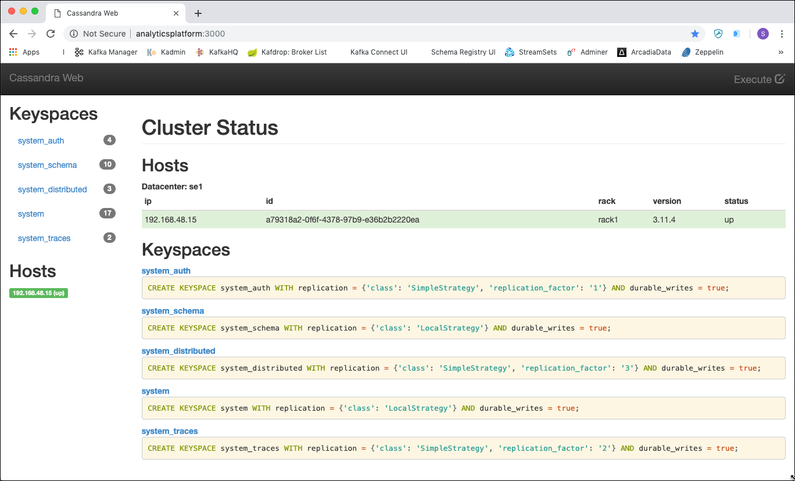
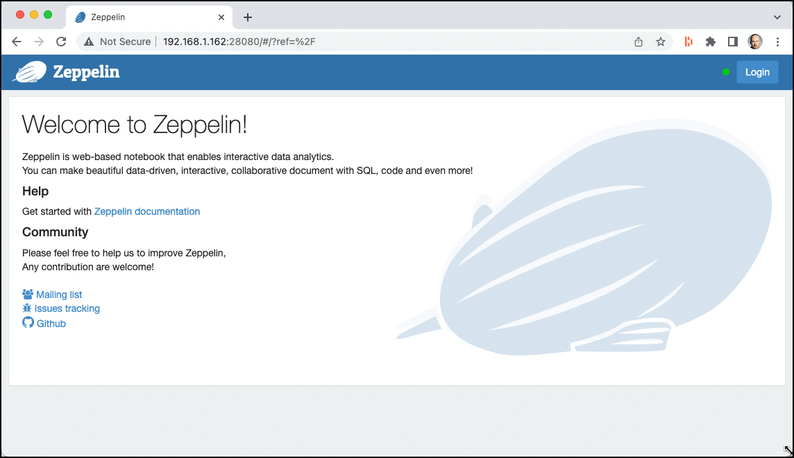
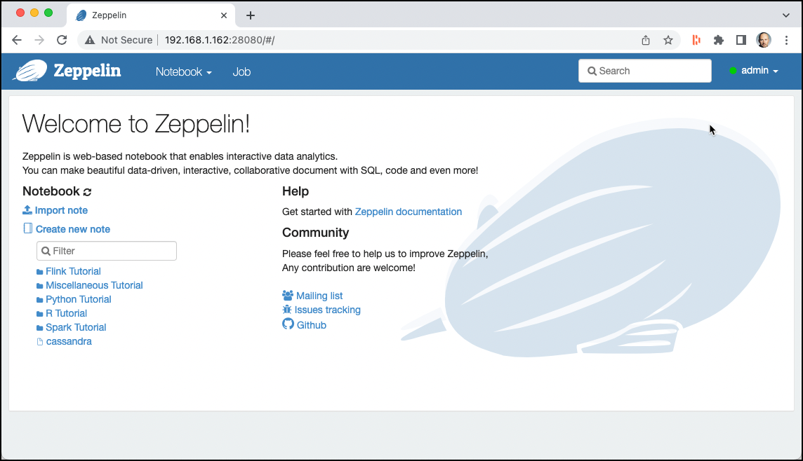
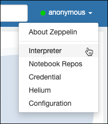
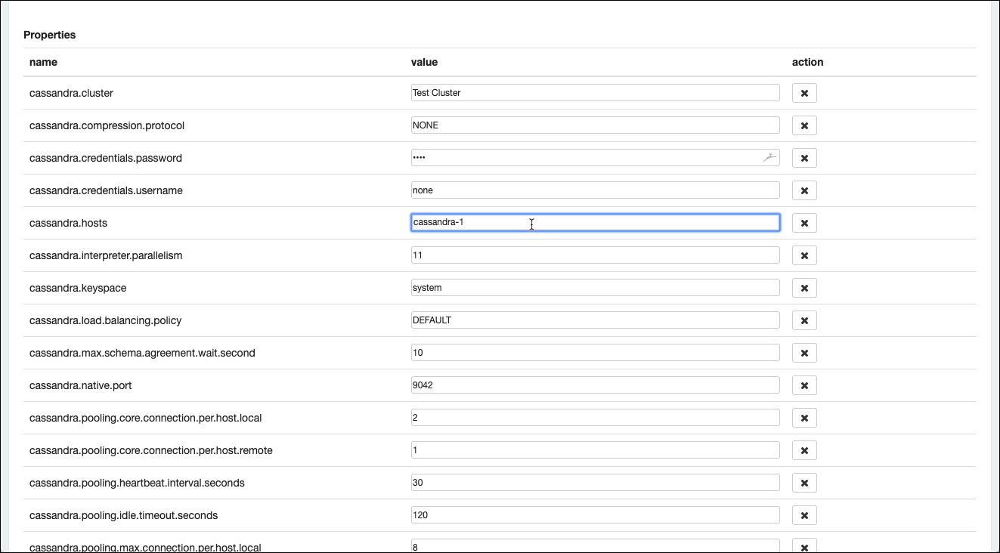
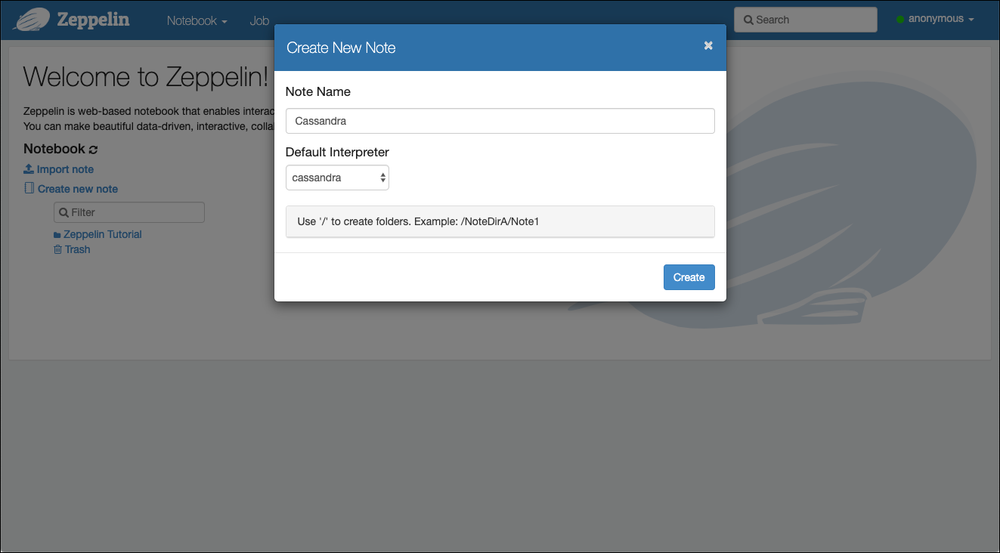
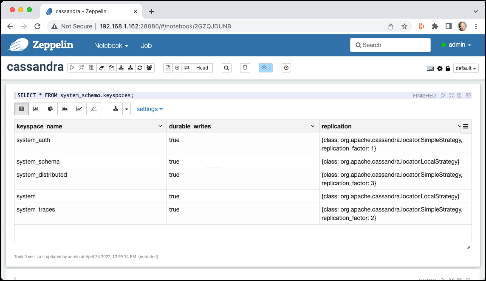

# Работа в Cassandra
На этом семинаре мы научимся использовать базу данных Apache Cassandra NoSQL.

Мы предполагаем, что описанная [здесь](../01-environment) платформа запущена и доступна.

## Подключение к среде Cassandra

### Использование утилиты командной строки Cassandra

Вы можете найти утилиту командной строки `cqlsh` внутри контейнера Cassandra Docker, работающего как часть платформы. Подключитесь через SSH к Docker Host и выполните следующую команду `docker exec`

```
sudo docker exec -ti cassandra-1 cqlsh -u cassandra -p cassandra
```

Это подключит вас к контейнеру `cassandra-1` и запустит `cqlsh` внутри id. Вы должны увидеть вывод, похожий на этот.

```bash
bigdata@bigdata:~$ docker exec -ti cassandra-1 cqlsh-u cassandra -p cassandra
Connected to CassandraCluster at 127.0.0.1:9042.
[cqlsh 5.0.1 | Cassandra 3.11.19 | CQL spec 3.4.4 | Native protocol v4]
Use HELP for help.
cqlsh>
```

Теперь вы находитесь в командной строке Cassandra CQL и готовы выполнять операторы CQL.

Мы также можем увидеть актуальную версию Cassandra, CQL и cqlsh, доступную нам.

Попробуйте выполнить следующий оператор CQL

```sql
SELECT * FROM system_schema.keyspaces;
```

и вы должны увидеть существующие в настоящее время пространства ключей в качестве результатов

```sql
cqlsh> SELECT * FROM system_schema.keyspaces;
```

```

 keyspace_name      | durable_writes | replication
--------------------+----------------+-------------------------------------------------------------------------------------
        system_auth |           True | {'class': 'org.apache.cassandra.locator.SimpleStrategy', 'replication_factor': '1'}
      system_schema |           True |                             {'class': 'org.apache.cassandra.locator.LocalStrategy'}
 system_distributed |           True | {'class': 'org.apache.cassandra.locator.SimpleStrategy', 'replication_factor': '3'}
             system |           True |                             {'class': 'org.apache.cassandra.locator.LocalStrategy'}
      system_traces |           True | {'class': 'org.apache.cassandra.locator.SimpleStrategy', 'replication_factor': '2'}

(5 rows)
```

### Использование браузерного графического интерфейса
Вместо работы через командную строку и, следовательно, необходимости подключаться к Docker Host через SSH, мы также можем использовать браузерный графический интерфейс для доступа к Cassandra. В качестве части платформы доступны две браузерные утилиты.

#### Cassandra Web

Первый — [Cassandra Web](http://avalanche123.com/cassandra-web/).
В окне браузера перейдите по адресу <http://localhost:28120/>, и вы сразу попадете на главный экран, как показано ниже.



Если нажать кнопку **Execute CQL** в правом верхнем углу, появится всплывающее окно, в котором можно ввести операторы CQL и выполнить их.

#### Apache Zeppelin

Другой универсальный инструмент «данных» — [Apache Zeppelin](http://zeppelin.apache.org). В окне браузера перейдите на <http://localhost:28080/>, и вы сразу же попадете на главный экран, как показано ниже.


Нажмите **Login** в правом верхнем углу и введите `admin` в поле **User Name** и `abc123!` в поле **Password**. Нажмите **Login**.



Apache Zeppelin использует так называемую модель на основе «Notebook», которая позволяет выполнять интерактивную аналитику данных и совместную работу с документами на основе SQL, Scala и т. д.

Zeppelin использует концепцию интерпретаторов. Каждый интерпретатор может «общаться» с заданными системами данных. При создании Notebook вы можете указать интерпретатор «по умолчанию», все остальные интерпретаторы также могут использоваться, но тогда в каждой ячейке должна использоваться директива `%<interpreter-name>`.

Zeppelin подключил интерпретатор Cassandra, который мы будем здесь использовать. Но прежде чем мы сможем его использовать, его нужно настроить. Щелкните раскрывающийся список **anonymous** или **User Name** вверху справа  и выберите **Interpreter**, как показано на изображении ниже.



Выбрать **Cassandra** Interpreter, выполнив поиск или прокрутив страницу вниз, чтобы добраться до него. Нажмите **edit** и измените **cassandra.credentials.username** на `cassandra`, **cassandra.credentials.password** на `cassandra` и свойство **cassandra.host** на `cassandra-1` (имя службы нашего узла Cassandra в конфигурации docker-compose).



Прокрутите вниз до конца настроек интерпретатора и нажмите **Save**. Подтвердите, чтобы Zeppelin перезапустил интерпретатор с новыми настройками.

Нажмите **Zeppelin** в верхнем левом углу, чтобы вернуться на главный экран.

Создадим новый блокнот, нажав на ссылку **Create new note**. Во всплывающем окне введите `Cassandra` в поле **Note Nam** и выберите **cassandra** для **Default Interpreter** и нажмите **Create**.




Появится пустой блокнот с одной ячейкой. Теперь эта ячейка готова к использованию и имеет назначенную интерпретацию Cassandra. Введите каждую команду в отдельную ячейку и либо щелкните значок **play** справа, либо нажмите **Ctrl-Enter**, чтобы выполнить ячейку. Новая ячейка автоматически появится при выполнении текущей.

Выполните скрипт

```sql
SELECT * FROM system_schema.keyspaces;
```
выполните скрипт, должны увидеть существующие на данный момент пространства ключей



Для всех команд, которые следуют сейчас в этом семинаре, вы можете использовать один из 3 различных вариантов, показанных выше.

## Create a Keyspace for the Movie sample

Keyspace в Cassandra является эквивалентом database/schema в реляционных базах данных. При создании keyspace необходимо указать настройки репликации:

```
CREATE KEYSPACE movies WITH replication =
  {'class':'SimpleStrategy','replication_factor':1};
```
Мы будем использовать SimpleStrategy для простоты, поскольку наша настройка Cassandra — это всего лишь один узел.

В производственной среде, где обычно имеется несколько центров обработки данных, обычно используется `NetworkTopologyStrategy`, поскольку она лучше распределяет данные по центрам обработки данных.

Коэффициент репликации = 1 означает, что на определенном узле будет одна копия строки. Более высокие коэффициенты репликации устанавливаются в реальных системах для создания нескольких реплик, что обеспечивает доступность данных в случае сбоев диска.

Чтобы иметь возможность работать с таблицами, вам необходимо использовать свое пространство ключей, как показано в следующем операторе:


```
USE movies;
```
Другой вариант — добавлять к имени таблицы префикс имени пространства ключей во всех запросах, аналогично тому, что вы можете сделать при ссылке на схему.

В любое время вы можете `DESCRIBE` пространство ключей, для этого используйте следующую команду:

```
DESCRIBE KEYSPACE movies;
```

получим

```
CREATE KEYSPACE movies WITH replication = {'class': 'SimpleStrategy', 'replication_factor': '1'}  AND durable_writes = true;
```

Если вы хотите перечислить все пространства ключей, имеющиеся в базе данных, резервное пространство ключей Cassandra с именем system будет вам полезно. Оно содержит множество системных таблиц для определения объектов базы данных и конфигурации кластера. Давайте перечислим все записи из таблицы `schema_keyspaces`, которая содержит записи для каждого пространства ключей.

Введите следующую команду:

```
SELECT * FROM system_schema.keyspaces;
```

получим

```
 keyspace_name      | durable_writes | replication
--------------------+----------------+-------------------------------------------------------------------------------------
        system_auth |           True | {'class': 'org.apache.cassandra.locator.SimpleStrategy', 'replication_factor': '1'}
      system_schema |           True |                             {'class': 'org.apache.cassandra.locator.LocalStrategy'}
             movies |           True | {'class': 'org.apache.cassandra.locator.SimpleStrategy', 'replication_factor': '1'}
 system_distributed |           True | {'class': 'org.apache.cassandra.locator.SimpleStrategy', 'replication_factor': '3'}
             system |           True |                             {'class': 'org.apache.cassandra.locator.LocalStrategy'}
      system_traces |           True | {'class': 'org.apache.cassandra.locator.SimpleStrategy', 'replication_factor': '2'}
```

## Использование "Static" таблиц (skinny row)

### Создайте таблицы Movie и Actor 

Выполните следующую инструкцию для создания таблицы с именем user. Для тех, кто знаком с SQL, следующий синтаксис должен показаться очень знакомым и почти идентичным. Даже некоторые соглашения об именовании, а также правила форматирования можно использовать повторно.

```sql
DROP TABLE IF EXISTS movies.movie;
CREATE TABLE movies.movie (movie_id int,
	title text,				// title
	release_year int,		// year
	running_time int, 		// runtimes
	languages set<text>, 	// language codes
	genres set<text>,      	// genres
	plot_outline text,    	// plot outline
   cover_url text, 			// cover url
   top250_rank int,			// top 250 rank
   PRIMARY KEY (movie_id)
);
```

Это создает первое статическое семейство столбцов (таблицу) в Cassandra. Теперь сделайте то же самое для таблицы Actor.

```sql
DROP TABLE IF EXISTS movies.actor;
CREATE TABLE movies.actor (actor_id int,
  name text,					// name
  headshot_url text,		// headshot
  mini_biography text,		// mini biography
  birth_date text,			// birth date
  trade_mark list<text>,	// trade mark
  PRIMARY KEY (actor_id)
);
```

Вы можете просмотреть метаданные таблицы с помощью команды `DESCRIBE`, как показано в следующем операторе.

```
DESCRIBE TABLE movie;
DESCRIBE TABLE actor;
```

### Вставка данных в Movie b Actor

В Cassandra операция INSERT на самом деле является "Upsert" (UPDATE или INSERT), что означает, что столбцы обновляются в случае, если строка для данного первичного ключа уже существует, в противном случае все столбцы вставляются заново.

Сначала добавим фильмы "Матрица" и "Криминальное чтиво"

```sql
// insert "The Matrix" - 0133093
INSERT INTO movies.movie (movie_id, title, release_year, running_time, languages,
                   genres, plot_outline, cover_url, top250_rank)
VALUES (0133093,
        'The Matrix',
 		1999,
 		136,
      {'en'},
      {'Action', 'Sci-Fi'},
      $$Thomas A. Anderson is a man living two lives. By day he is an average computer programmer and by night a hacker known as Neo. Neo has always questioned his reality, but the truth is far beyond his imagination. Neo finds himself targeted by the police when he is contacted by Morpheus, a legendary computer hacker branded a terrorist by the government. Morpheus awakens Neo to the real world, a ravaged wasteland where most of humanity have been captured by a race of machines that live off of the humans' body heat and electrochemical energy and who imprison their minds within an artificial reality known as the Matrix. As a rebel against the machines, Neo must return to the Matrix and confront the agents: super-powerful computer programs devoted to snuffing out Neo and the entire human rebellion$$,
      'https://m.media-amazon.com/images/M/MV5BNzQzOTk3OTAtNDQ0Zi00ZTVkLWI0MTEtMDllZjNkYzNjNTc4L2ltYWdlXkEyXkFqcGdeQXVyNjU0OTQ0OTY@._V1_SX101_CR0,0,101,150_.jpg',
      19);

// insert "Pulp Fiction" - 0110912
INSERT INTO movies.movie (movie_id, title, release_year, running_time, languages,
                   genres, plot_outline, cover_url, top250_rank)
VALUES (0110912,
 		'Pulp Fiction',
 		1994,
 		154,
 		{'en', 'es', 'fr'},
 		{'Crime', 'Drama'},
 		$$Jules Winnfield (Samuel L. Jackson) and Vincent Vega (John Travolta) are two hit men who are out to retrieve a suitcase stolen from their employer, mob boss Marsellus Wallace (Ving Rhames). Wallace has also asked Vincent to take his wife Mia (Uma Thurman) out a few days later when Wallace himself will be out of town. Butch Coolidge (Bruce Willis) is an aging boxer who is paid by Wallace to lose his fight. The lives of these seemingly unrelated people are woven together comprising of a series of funny, bizarre and uncalled-for incidents.$$,
 		'https://m.media-amazon.com/images/M/MV5BNGNhMDIzZTUtNTBlZi00MTRlLWFjM2ItYzViMjE3YzI5MjljXkEyXkFqcGdeQXVyNzkwMjQ5NzM@._V1_SY150_CR1,0,101,150_.jpg',
 		8);

// insert "Speed" - 0111257
INSERT INTO movies.movie (movie_id, title, release_year, running_time, languages,
                   genres, plot_outline, cover_url, top250_rank)
VALUES (0111257,
		 'Speed',
		 1994,
		 116,
		 {'en'},
		 {'Action', 'Adventure', 'Crime', 'Thriller'},
		 $$Bomber extortionist's elevator plan backfires, so he rigs a bomb to a LA city bus. The stipulation is: once armed, the bus must stay above 50 mph to keep from exploding. Also if LAPD Officer tries to unload any passengers off, Payne will detonate it. Joe Morton co-stars as Jack's superior, and Jeff Daniels supports Jack helping him try to defuse the bomb.$$,
		 'https://m.media-amazon.com/images/M/MV5BYjc0MjYyN2EtZGRhMy00NzJiLWI2Y2QtYzhiYTU3NzAxNzg4XkEyXkFqcGdeQXVyMTQxNzMzNDI@._V1_SY150_CR0,0,101,150_.jpg',
		  null); 		
```

Теперь давайте также добавим некоторых актеров, играющих в этих 2 фильмах.

Давайте добавим актеров "Bruce Willis", "John Travolta", "Sandra Bullock", "Samuel L. Jackson", "Uma Thurman" & "Quentin Tarantino"

```sql
// insert "Bruce Willis" - 0000246
INSERT INTO movies.actor (actor_id, name, headshot_url, birth_date, trade_mark)
VALUES (0000246,
 		'Bruce Willis',
 		'https://m.media-amazon.com/images/M/MV5BMjA0MjMzMTE5OF5BMl5BanBnXkFtZTcwMzQ2ODE3Mw@@._V1_UY98_CR8,0,67,98_AL_.jpg',
 		'1955-03-19',
		 ['Frequently plays a man who suffered a tragedy, had lost something or had a  crisis of confidence or conscience.',
		  'Frequently plays likeable wisecracking heroes with a moral centre',
		  'Headlines action-adventures, often playing a policeman, hitman or someone in the military',
		  'Often plays men who get caught up in situations far beyond their control',
		  'Sardonic one-liners',
		  'Shaven head',
		  'Distinctive, gravelly voice',
		  'Smirky grin.',
		  'Known for playing cynical anti-heroes with unhappy personal lives']);

// insert "John Travolta" - 0000237
INSERT INTO movies.actor (actor_id, name, headshot_url, birth_date, trade_mark)
VALUES (0000237,
		 'John Travolta',
		 'https://m.media-amazon.com/images/M/MV5BMTUwNjQ0ODkxN15BMl5BanBnXkFtZTcwMDc5NjQwNw@@._V1_UY98_CR3,0,67,98_AL_.jpg',
		 '1954-02-18',
		 ['Cleft chin and razor-sharp cheekbones',
		  'Often works some sort of dance into his roles',
		  'New Jersey accent',
		  'Black hair and blue eyes']);


// insert "Sandra Bullock" - 0000113
INSERT INTO movies.actor (actor_id, name, headshot_url, birth_date, trade_mark)
VALUES (0000113,
		'Sandra Bullock',
        'https://m.media-amazon.com/images/M/MV5BMTI5NDY5NjU3NF5BMl5BanBnXkFtZTcwMzQ0MTMyMw@@._V1_UX67_CR0,0,67,98_AL_.jpg',
        '1964-07-26',
        null);

// insert "Samuel L. Jackson" - 0000168
INSERT INTO movies.actor (actor_id, name, headshot_url, birth_date, trade_mark)
VALUES (0000168,
		 'Samuel L. Jackson',
		 'https://m.media-amazon.com/images/M/MV5BMTQ1NTQwMTYxNl5BMl5BanBnXkFtZTYwMjA1MzY1._V1_UX67_CR0,0,67,98_AL_.jpg',
		 '1948-12-21',
		 ['Deep authoritative voice',
		  'Rebellious characters who are disliked or considered strange by others in the story',
		  'Often plays police officers or government officials. Both prone to intimidation or violence',
		  'Often plays very wise and intelligent characters with great capacities for violence',
		  'Frequently plays tough characters who swear a lot',
		  'Frequent swearing',
		  'Often sports a moustache or goatee in his films',
		  'Shaven head',
		  'Kangol hats',
		  'Often plays hotheaded characters with a fiery temper',
		  'Often shouts the word "motherf*****" at some point in a film',
		  'Frequently cast by Quentin Tarantino']);

// insert "Uma Thurman" - 0000235
INSERT INTO movies.actor (actor_id, name, headshot_url, birth_date, trade_mark)
VALUES (0000235,
		 'Uma Thurman',
		 'https://m.media-amazon.com/images/M/MV5BMjMxNzk1MTQyMl5BMl5BanBnXkFtZTgwMDIzMDEyMTE@._V1_UX67_CR0,0,67,98_AL_.jpg',
		 '1970-04-29',
		 ['Long blond hair and blue eyes', 'Statuesque, model-like figure']);

// insert "Keanu Reeves" - 0000206
INSERT INTO movies.actor (actor_id, name, headshot_url, birth_date, trade_mark)
VALUES (0000206,
		 'Keanu Reeves',
 		 'https://m.media-amazon.com/images/M/MV5BNjUxNDcwMTg4Ml5BMl5BanBnXkFtZTcwMjU4NDYyOA@@._V1_UY98_CR4,0,67,98_AL_.jpg',
 		 '1964-09-02',
		 ['Intense contemplative gaze',
		  'Deep husky voice',
		  'Known for playing stoic reserved characters']);

// insert "Quentin Tarantino" - 0000233
INSERT INTO movies.actor (actor_id, name, headshot_url, birth_date, trade_mark)
VALUES (0000233,
         'Quentin Tarantino',
         'https://m.media-amazon.com/images/M/MV5BMTgyMjI3ODA3Nl5BMl5BanBnXkFtZTcwNzY2MDYxOQ@@._V1_UX67_CR0,0,67,98_AL_.jpg',
         '1963-03-27',
         ['Lead characters usually drive General Motors vehicles, particularly Chevrolet and Cadillac, such as Jules 1974 Nova and Vincents 1960s Malibu.',
          'Briefcases and suitcases play an important role in Pulp Fiction (1994), Reservoir Dogs (1992), Jackie Brown (1997), True Romance (1993) and Kill Bill: Vol. 2 (2004).',
          'Makes references to cult movies and television',
          'Frequently works with Harvey Keitel, Tim Roth, Michael Madsen, Uma Thurman, Michael Bowen, Samuel L. Jackson, Michael Parks and Christoph Waltz.',
          'His films usually have a shot from inside an automobile trunk',
          'He always has a Dutch element in his films: The opening tune, Little Green Bag, in Reservoir Dogs (1992) was performed by George Baker Selection and written by Jan Gerbrand Visser and Benjamino Bouwens who are all Dutch. The character Freddy Newandyke, played by Tim Roth is a direct translation to a typical Dutch last name, Nieuwendijk. The code name of Tim Roth is Mr. Orange, the royal color of Holland and the last name of the royal family. The Amsterdam conversation in Pulp Fiction (1994), Vincent Vega smokes from a Dutch tobacco shag (Drum), the mentioning of Rutger Hauer in Jackie Brown (1997), the brides name is Beatrix, the name of the Royal Dutch Queen.',
		  '[The Mexican Standoff] All his movies (including True Romance (1993), which he only wrote and did not direct) feature a scene in which three or more characters are pointing guns at each other at the same time.',
         'Often uses an unconventional storytelling device in his films, such as retrospect (Reservoir Dogs (1992)), non-linear (Pulp Fiction (1994)), or "chapter" format (Kill Bill: Vol. 1 (2003)).',
         'His films will often include one long, unbroken take where a character is  followed around somewhere.']);
```

### Отображение данных

Команда SELECT выводит список содержимого таблицы; фильтр можно применить с помощью предложения WHERE:

```sql
SELECT movie_id, title
FROM movies.movie;
```

Можно выбрать все столбцы, как показано здесь для таблицы «Актёр»:

```sql
SELECT *
FROM movies.actor;
```

Результат предыдущих запросов SELECT может заставить вас задуматься, ведь они похожи на таблицы в РСУБД, неужели данные хранятся в таблицах в Cassandra?

Ответ  таков: хотя CQL предоставляет вам удобный интерфейс, похожий на привычную РСУБД, данные хранятся в Cassandra в соответствии с ее собственной моделью данных.

Что произойдет, если поставить фильтр, например на `name` актера.


```sql
SELECT *
FROM movies.actor
WHERE name = 'Bruce Willis';
```

получим ошибку

```
com.datastax.driver.core.exceptions.InvalidQueryException:
Cannot execute this query as it might involve data filtering and thus may have unpredictable performance.
If you want to execute this query despite the performance unpredictability, use ALLOW FILTERING
```
Cassandra не позволяет ограничивать по  столбцу, кроме первичного ключа. Проерим поле `actor_id`, запрос при этом отработает.

```sql
SELECT *
FROM movies.actor
WHERE actor_id = 0000246;
```
Как указано в исключении, вы можете заставить Cassandra применить ограничение к неосновному столбцу, добавив предложение `ALLOW FILTERING`.

```sql
SELECT *
FROM movies.actor
WHERE name = 'Bruce Willis'
ALLOW FILTERING;
```
Но будьте осторожны. Это **крайне неэффективно** для Cassandra, и есть веская причина, по которой `ALLOW FILTERING` не включено по умолчанию.


### Обновление данных
Вы можете использовать `UPDATE` для изменения данных. Как было сказано ранее, это будет иметь тот же эффект, что и `INSERT`.

Давайте обновим актера Bruce Willis  и добавим его фамилию.


```sql
UPDATE movies.actor
SET name = 'Bruce Walter Willis'
WHERE actor_id = 0000246;
```

Проверьте результат с помощью `SELECT`.

```sql
SELECT *
FROM movies.actor
WHERE actor_id = 0000246;
```
Такой же результат можно получить с помощью следующей вставки: обновив адрес электронной почты на другое значение.

```sql
INSERT INTO movies.actor (actor_id, name)
VALUES (0000246, 'Bruce Willis');
```
Проверьте результат еще раз с помощью `SELECT`. Вы можете видеть, что `name` было обновлено.

Теперь давайте покажем, что с помощью `UPDATE` vj;yj  создать новую запись:

```sql
UPDATE movies.actor
SET name = 'Cool Actor'
WHERE actor_id = 99999999;
```
Видим, что `INSERT` не будет ругаться, если строка уже существует под данным первичным ключом (ключом строки). Он даже обновит эту строку. Огромная разница по сравнению с РСУБД!

Будьте осторожны и всегда передавайте правильное значение первичного ключа, иначе могут возникнуть неожиданные результаты.


### Удаление данных
Также можем удалить данные.

Данные можно удалить с помощью CQL одним из следующих способов

1. Удаляем можем столбцы или целые строки
2. `TRUNCATE`: удаляет все строки из таблицы
3. `USING TTL`: устанавливает время жизни столбцов в строке; по истечении указанного периода столбцы автоматически удаляются Cassandra.

Удалим актера с идентификатором 99999999, которого  только что вставили, с помощью `DELETE`:


```sql
DELETE FROM movies.actor
WHERE actor_id = 99999999;
```

посмотрим результат

```sql
INSERT INTO movies.actor (actor_id, name)
VALUES (99999998, 'An other actor')
USING TTL 120;
```

Итак, этот тестовый пользователь будет автоматически удален через 120 секунд.

Вы можете проверить оставшийся TTL, используя функцию TTL в столбце


```sql
SELECT TTL(name), actor_id, name
FROM movies.actor;
```

Все строки без TTL возвращают NULL, а строка, которую добавили ранее, возвращает количество секунд, оставшихся до удаления записи.

Если повторно выполните этот оператор, увидите, что TTL уменьшается до тех пор, пока запись не исчезнет.

Это завершает нашу работу со статическими таблицами. В следующем разделе увидим, как можно использовать динамические таблицы, которые являются гораздо более интересной и важной частью Cassandra.

До сих пор  хранили только информацию, которая является статической таким образом, что количество столбцов, которые  хотели сохранить в Movie и Actor, является статическим во время выполнения. Конечно,  можем время от времени расширять модель данных и добавлять новые столбцы в существующую таблицу. Но эта задача может быть выполнена с помощью оператора `ALTER TABLE xxxx ADD COLUMN ...`.


## Использование "Dynamic" таблиц (wide row)

Динамические таблицы также позволяют увеличивать количество записей, поэтому количество столбцов постоянно изменяется во время выполнения, и каждая строка может иметь разное количество столбцов, хранящихся в таблице/базе данных.

До сих пор наши Movie и Actor, которые  сохранили в статической таблице Cassandra, не имеют «отношений» друг с другом. Но, при этом , можно сказать, что актер играл во многих фильмах, и в фильме играет много актеров.

Для хранения этой информации широкострочные таблицы являются инструментом, который можно использовать в Casandra.

Dynamic Tables allow also growing to the side, so the number of columns are basically dynamic at runtime and ever row can have a different number of columns stored in the table / database.

So far our Movies and Actors which we have stored in the so-named static Cassandra table have no "relationships" to each-other. But of course an actor has played in many movies and a movie has many actors playing in it.

Для хранения этой информации в Cassandra следует использовать таблицы с "широкими" строками.

### Создание таблицы «Фильмы по актерам» и «Актеры по фильмам».

Начнем с актера и фильмов, в которых он играл, которые мы называем `movies_by_actor`.

```sql
DROP TABLE IF EXISTS movies.movies_by_actor;
CREATE TABLE movies.movies_by_actor (actor_id int,
				movie_id int,  
				title text,
				PRIMARY KEY (actor_id, movie_id)
);
```

Создадим вторую таблицу, чтобы получить актеров, которые играли в данном фильме, то есть `actors_by_movie`

```sql
DROP TABLE IF EXISTS movies.actors_by_movie;
CREATE TABLE movies.actors_by_movie (movie_id int,
             title text STATIC,
				actor_id int,  
				name text,
				PRIMARY KEY (movie_id, actor_id)
);
```

### Вставка данных в две таблицы

Добавим несколько фильмов для данных актеров. Конечно, в реальном мире они играли в гораздо большем количестве фильмов, это всего лишь выборка фильмов для некоторых актеров, которые есть у нас в таблице `actor`. Но не все фильмы, которые мы добавляем здесь в таблицу `movies_by_actor`, на самом деле хранятся в таблице `movie`. Мы видим, что нет никаких внешних ключей, и никто не может помешать добавлять в эту таблицу фильмы, которые нам не "известны"/или не хранятся в таблице `movie`.

```sql
// Фильмы для актера "Bruce Willis"

INSERT INTO movies.movies_by_actor (actor_id, movie_id, title)
VALUES (0000246, 0110912, 'Pulp Fiction');

INSERT INTO movies.movies_by_actor (actor_id, movie_id, title)
VALUES (0000246, 1606378, 'A Good Day to Die Hard');

INSERT INTO movies.movies_by_actor (actor_id, movie_id, title)
VALUES (0000246, 0217869, 'Unbreakable');

INSERT INTO movies.movies_by_actor (actor_id, movie_id, title)
VALUES (0000246, 0377917, 'The Fifth Element');

INSERT INTO movies.movies_by_actor (actor_id, movie_id, title)
VALUES (0000246, 0112864, 'Die Hard: With a Vengeance');

// Фильмы для актера "Keanu Reeves"

INSERT INTO movies.movies_by_actor (actor_id, movie_id, title)
VALUES (0000206, 0133093, 'The Matrix');

INSERT INTO movies.movies_by_actor (actor_id, movie_id, title)
VALUES (0000206, 0234215, 'The Matrix Reloaded');

INSERT INTO movies.movies_by_actor (actor_id, movie_id, title)
VALUES (0000206, 0111257, 'Speed');


// Фильмы для актера "Sandra Bullock"

INSERT INTO movies.movies_by_actor (actor_id, movie_id, title)
VALUES (0000113, 0111257, 'Speed');
```
Добавим данные в таблицу `actors_by_movie`. Опять же, не все актеры, которых мы добавляем сюда, также хранятся в таблице `movie`. Теперь они должны быть синхронизированы, и при вставке данных это должно учитываться.

```
// Актеры для фильма "The Matrix"

INSERT INTO movies.actors_by_movie (movie_id, title, actor_id, name)
VALUES (0133093, 'The Matrix', 0000206, 'Keanu Reeves');

INSERT INTO movies.actors_by_movie (movie_id, title, actor_id, name)
VALUES (0133093, 'The Matrix', 0000401, 'Laurence Fishburne');

INSERT INTO movies.actors_by_movie (movie_id, title, actor_id, name)
VALUES (0133093, 'The Matrix', 0005251, 'Carrie-Anne Moss');

INSERT INTO movies.actors_by_movie (movie_id, title, actor_id, name)
VALUES (0133093, 'The Matrix', 0915989, 'Hugo Weaving');


// Актеры для фильма "Pulp Fiction"

INSERT INTO movies.actors_by_movie (movie_id, title, actor_id, name)
VALUES (0110912, 'Pulp Fiction', 0000237, 'John Travolta');

INSERT INTO movies.actors_by_movie (movie_id, title, actor_id, name)
VALUES (0110912, 'Pulp Fiction', 0000168, 'Samuel L. Jackson');

INSERT INTO movies.actors_by_movie (movie_id, title, actor_id, name)
VALUES (0110912, 'Pulp Fiction', 0000246, 'Bruce Willis');
```

Посмотрим на эти таблицы. Сначала посмотрим все фильмы, в которых играл "Брюс Уиллис".

```sql
SELECT title
FROM movies.movies_by_actor
WHERE actor_id = 0000246;
```

м посмотрим на актеров, сыгравших в фильме «Криминальное чтиво».

```sql
SELECT name, title
FROM movies.actors_by_movie
WHERE movie_id = 0110912;
```

## Использование столбцов-счетчиков

Для таблицы рейтингов фильмовбудем использовать статическую таблицу со столбцами типа `COUNTER`, чтобы могли легко подсчитать количество звезд, которые проставлены каждому фильму.

Столбцы типа COUNTER нельзя смешивать с другими типами данных, и поэтому придется создать новую таблицу, а не добавлять эти столбцы в существующую таблицу `movie`.


```sql
DROP TABLE IF EXISTS movies.rating_by_movie;
CREATE TABLE movies.rating_by_movie (movie_id int,
             one_star counter,  
             two_star counter,  
             three_star counter,  
             four_star counter,  
             five_star counter,
				PRIMARY KEY (movie_id)
);
```

Давайте добавим рейтинги для фильма "Криминальное чтиво". Со столбцами типа counter можно использовать команду `UPDATE`, а `INSERT` использовать нельзя!


```sql
UPDATE movies.rating_by_movie
SET five_star = five_star + 1
WHERE movie_id = 0110912;

UPDATE movies.rating_by_movie
SET four_star = four_star + 1
WHERE movie_id = 0110912;

UPDATE movies.rating_by_movie
SET five_star = five_star + 1
WHERE movie_id = 0110912;

UPDATE movies.rating_by_movie
SET five_star = five_star + 1
WHERE movie_id = 0110912;

UPDATE movies.rating_by_movie
SET two_star = two_star + 1
WHERE movie_id = 0110912;
```

Проверьте текущие рейтинги фильма "Криминальное чтиво"

```sql
SELECT * FROM movies.rating_by_movie WHERE movie_id = 0110912;
```

Cоздадим таблицу, которая подсчитывает количество просмотров каждого фильма, разделенных на зрителей-мужчин и женщин, и по месяцам.
В этом случае  создаем динамичную таблицу с `movie_id` для ключа раздела и `year` и `month` в качестве ключей кластеризации. Кроме того, храним столбцы кластеризации в порядке убывания по году и месяцу, чтобы можно было эффективно извлекать последние счетчики просмотров.


```sql
DROP TABLE IF EXISTS movies.movie_viewed_by_time;
CREATE TABLE movies.movie_viewed_by_time (movie_id int,
			   year int,
			   month int,
             male counter,
             female counter,
				PRIMARY KEY (movie_id, year, month)
) WITH CLUSTERING ORDER BY (year DESC, month DESC);
```

Добавьте несколько примеров значений в новую таблицу.

```sql
// Pulp Fiction Views 2019/03
UPDATE movies.movie_viewed_by_time
SET male = male + 1
WHERE movie_id = 0110912 AND year = 2019 and month = 03;

UPDATE movies.movie_viewed_by_time
SET male = male + 1
WHERE movie_id = 0110912 AND year = 2019 and month = 03;

UPDATE movies.movie_viewed_by_time
SET female = female + 1
WHERE movie_id = 0110912 AND year = 2019 and month = 03;

// Pulp Fiction Views 2019/04
UPDATE movies.movie_viewed_by_time
SET female = female + 1
WHERE movie_id = 0110912 AND year = 2019 and month = 04;

UPDATE movies.movie_viewed_by_time
SET male = male + 1
WHERE movie_id = 0110912 AND year = 2019 and month = 04;

UPDATE movies.movie_viewed_by_time
SET female = female + 1
WHERE movie_id = 0110912 AND year = 2019 and month = 04;

UPDATE movies.movie_viewed_by_time
SET female = female + 1
WHERE movie_id = 0110912 AND year = 2019 and month = 04;

// Pulp Fiction Views 2019/05
UPDATE movies.movie_viewed_by_time
SET male = male + 1
WHERE movie_id = 0110912 AND year = 2019 and month = 05;

UPDATE movies.movie_viewed_by_time
SET male = male + 1
WHERE movie_id = 0110912 AND year = 2019 and month = 05;

UPDATE movies.movie_viewed_by_time
SET female = female + 1
WHERE movie_id = 0110912 AND year = 2019 and month = 05;

UPDATE movies.movie_viewed_by_time
SET female = female + 1
WHERE movie_id = 0110912 AND year = 2019 and month = 05;
```

и вывести просмотры фильма "Криминальное чтиво" за все время

```sql
SELECT *
FROM movies.movie_viewed_by_time
WHERE movie_id = 0110912;
```

всего за один месяц

```
SELECT *
FROM movies.movie_viewed_by_time
WHERE movie_id = 0110912 AND year = 2019 AND month = 05;
```

или за месяц с января по май

```
SELECT *
FROM movies.movie_viewed_by_time
WHERE movie_id = 0110912 AND year = 2019 AND month >= 01 AND month <= 5;
```


## Using the Python API with Cassandra

как правило эта тема рассматривается в параллельном курсе по обработке  данных средствами Python


# Варианты индивидуальных заданий


