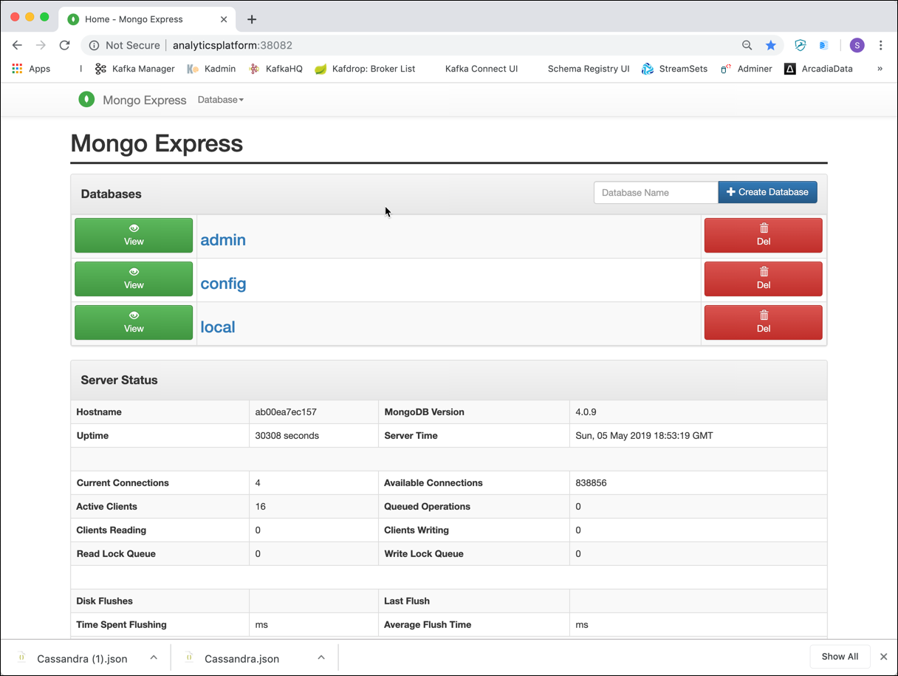

# Работа с MongoDB

В этом семинаре научимся использовать базу данных MongoDB NoSQL.

Предполагаем, что платформа, описанная [здесь](../01-environment), запущена и доступна.

## Подключение к среде MongoDB

### Использование утилиты командной строки MongoDB

Можно найти утилиту командной строки `mongo` внутри контейнера Docker MongoDB, работающего как часть платформы. Подключитесь к хосту Docker и выполните следующую команду `docker exec`

```
sudo docker exec -ti mongo-1 mongosh -u "root" -p "abc123!"
```

Это позволит вам подключиться к контейнеру `mongo` и запустить оболочку `mongo` внутри него.

Вы должны увидеть вывод, аналогичный приведенному ниже.

```bash
bigdata@bigdata:~$ docker exec -ti mongo-1 mongosh -u "root" -p "abc123!"
Current Mongosh Log ID: 67b215162e08a3633d544ca6
Connecting to:          mongodb://<credentials>@127.0.0.1:27017/?directConnection=true&serverSelectionTimeoutMS=2000&appName=mongosh+2.3.8
Using MongoDB:          7.0.16
Using Mongosh:          2.3.8

For mongosh info see: https://www.mongodb.com/docs/mongodb-shell/


To help improve our products, anonymous usage data is collected and sent to MongoDB periodically (https://www.mongodb.com/legal/privacy-policy).
You can opt-out by running the disableTelemetry() command.

------
   The server generated these startup warnings when booting
   2025-02-16T16:10:32.061+00:00: Using the XFS filesystem is strongly recommended with the WiredTiger storage engine. See http://dochub.mongodb.org/core/prodnotes-filesystem
   2025-02-16T16:10:33.459+00:00: vm.max_map_count is too low
------

test> 

```

Теперь вы находитесь в командной строке MongoDB, готовой к выполнению любых операторов MongoDB. Также можно увидеть версию сервера MongoDB и оболочки MongoDB.

Оболочка запускает JavaScript. Есть несколько глобальных команд, которые вы можете выполнить, например help или exit. Команды, которые вы выполняете для текущей базы данных, выполняются для объекта db, например `db.help()` или `db.stats()`.

Команды, которые выполняются для определенной коллекции, выполняются для объекта `db.COLLECTION_NAME`, например `db.movies.help()` или `db.movies.countDocuments()`.

Выполнив команду `db.help()`,  получите список команд, которые вы можете выполнить для объекта db.

**Примечание:** Поскольку это оболочка JavaScript, если выполните метод и опустите скобки (),  увидите тело метода, а не выполнение метода. Первый раз, когда выполните запрос и получите ответ, который начинается с function (...){, вас это не удивляло. Например, если  введете db.help (без скобок),  увидите внутреннюю реализацию метода help.

### Использование браузерного графического интерфейса

Вместо работы в командной строке и, следовательно, необходимости подключаться к Docker Host, можем использовать браузерный графический интерфейс для доступа к MongoDB. В рамках платформы доступны две браузерные утилиты.

#### Mongo Express

Первый — [Mongo Express](https://github.com/mongo-express/mongo-express), веб-интерфейс администратора MongoDB, написанный с помощью Node.js, Express и Bootstrap3.

В окне браузера перейдите на <http://localhost:28203/>, с именем пользователя `admin` и паролем `pass`, переходим на главный экран, как показано ниже.



#### Admin Mongo
Второй — [Admin Mongo](https://github.com/adicom-systems/adminMongo), открытый исходный интерфейс администратора для MongoDB.

В окне браузера перейдите на <http://localhost:28204/> и войдите с именем пользователя `admin` и паролем `pass`, и вы должны увидеть главный экран, как показано ниже.


Чтобы подключиться к экземпляру MongoDB, добавьте новое подключение к Admin Mongo. Введите `Data Platform` в поле **Имя подключения** и `mongodb://mongo-1:27017` в поле **Строка подключения** и нажмите **Добавить подключение**. Должно появиться сообщение о том, что подключение было успешно добавлено.


Нажатие кнопки **Подключить** открывает страницу сведений об администрировании Mongo для подключения.

### Использование настольных приложений

Существуют также различные настольные приложения для управления и администрирования MongoDB, которые можно загрузить и установить на рабочем столе, например `Mongo Compass`. Оттуда можете подключиться как к локальному, так и к удаленному экземпляру Mongo.

#### Studio 3T (ранее известная как Robo 3T или Robomongo)

[Studio 3T](https://robomongo.org/) - приложение, встраивающее оболочку MongoDB. Оно доступно для Windows, Mac и Linux.


Нажмите на значок **Подключить** в левом верхнем углу и нажмите **Новое подключение**, чтобы создать новое подключение.

Введите `NosqlPlatform` или IP-адрес вашего Docker Host в поле **Сервер**. Оставьте порт 27017 и нажмите **Сохранить**. Выбрав только что созданное подключение, нажмите **Подключить**. С правой стороны должны увидеть список доступных баз данных.

## Работа с MongoDB

Рассмотрим основные механизмы работы с MongoDB. Это основа для понимания MongoDB.

`6` Концепций MongoDB.

1. MongoDB имеет ту же концепцию базы данных, с которой вы, вероятно, уже знакомы (или схему для вас, Oracle). Внутри экземпляра MongoDB у вас может быть ноль или более баз данных, каждая из которых действует как высокоуровневые контейнеры для всего остального.
2. База данных может иметь ноль или более коллекций. Коллекция имеет достаточно общего с традиционной таблицей, поэтому вы можете смело считать их одним и тем же.
3. Коллекции состоят из нуля или более документов. Опять же, документ можно смело считать строкой.
4. Документ состоит из одного или нескольких полей, которые, как вы, вероятно, можете догадаться, во многом похожи на столбцы.
5. Индексы в MongoDB функционируют в основном так же, как их аналоги в СУРБД.
6. Курсоры отличаются от пяти других концепций, но они достаточно важны и часто упускаются из виду, поэтому я считаю, что они достойны отдельного обсуждения. Важно понимать, что курсоры — это то, что когда вы запрашиваете данные у MongoDB, он возвращает указатель на результирующий набор, называемый курсором, с которым мы можем что-то делать, например, подсчитывать или пропускать, прежде чем фактически извлекать данные.

Подводя итог, MongoDB состоит из баз данных, содержащих коллекции. Коллекция состоит из документов. Каждый документ состоит из полей. Коллекции можно индексировать, что повышает производительность поиска и сортировки. Наконец, когда мы получаем данные из MongoDB, мы делаем это через курсор, фактическое выполнение которого откладывается до необходимости.

Зачем использовать новую терминологию (коллекция против таблицы, документ против строки и поле против столбца)? Просто чтобы все усложнить? Правда в том, что, хотя эти концепции похожи на свои аналоги в реляционных базах данных, они не идентичны. Основное различие заключается в том, что реляционные базы данных определяют столбцы на уровне таблицы, тогда как документоориентированная база данных определяет свои поля на уровне документа. То есть каждый документ в коллекции может иметь свой собственный уникальный набор полей. Таким образом, коллекция — это упрощенный контейнер по сравнению с таблицей, в то время как документ содержит гораздо больше информации, чем строка.

Хотя это важно понимать, не волнуйтесь, если что-то еще не ясно. Потребуется не больше пары вставок, чтобы увидеть, что это на самом деле означает. В конечном счете, суть в том, что коллекция не является строгой в отношении того, что в нее попадает (она не имеет схемы). Поля отслеживаются с каждым отдельным документом. Преимущества и недостатки этого будут рассмотрены в будущей главе.

Итак, начнем в оболочке MongoDB.

Сначала мы используем глобальный помощник use для переключения баз данных, поэтому продолжайте и введите

```
use filmdb
```

Неважно, что база данных на самом деле еще не существует. Первая коллекция, которую мы создадим, также создаст базу данных `filmdb`. Теперь, когда вы находитесь внутри базы данных, вы можете начать выполнять команды базы данных, такие как `db.getCollectionNames()`.

```
db.getCollectionNames()
```

Вы получите пустой массив, так как в базе данных `filmdb` пока нет коллекций.

Поскольку коллекции не имеют схемы, нам не нужно явно создавать их, и мы можем напрямую начать добавлять документы в коллекцию.

## Создание документов Movie в коллекции `movies`

Мы можем просто вставить документ в новую коллекцию. Для этого используйте команду `insert`, указав в ней документ для вставки:

Добавьте документ для фильма "Pulp Fiction" в коллекцию `movies`. Приведенную ниже команду можно использовать из оболочки MongoDB.

```
db.movies.insertOne (
{ 
    "id": "0110912", 
    "title": "Pulp Fiction",
    "year": 1994,
    "runtime": 154,
    "languages": ["en", "es", "fr"],
    "rating": 8.9,
    "votes": 2084331,
    "genres": ["Crime", "Drama"],
    "plotOutline": "Jules Winnfield (Samuel L. Jackson) and Vincent Vega (John Travolta) are two hit men who are out to retrieve a suitcase stolen from their employer, mob boss Marsellus Wallace (Ving Rhames). Wallace has also asked Vincent to take his wife Mia (Uma Thurman) out a few days later when Wallace himself will be out of town. Butch Coolidge (Bruce Willis) is an aging boxer who is paid by Wallace to lose his fight. The lives of these seemingly unrelated people are woven together comprising of a series of funny, bizarre and uncalled-for incidents.",
    "coverUrl": "https://m.media-amazon.com/images/M/MV5BNGNhMDIzZTUtNTBlZi00MTRlLWFjM2ItYzViMjE3YzI5MjljXkEyXkFqcGdeQXVyNzkwMjQ5NzM@._V1_SY150_CR1,0,101,150_.jpg",
    "actors": [
        { "actorID": "0000619", "name": "Tim Roth"},
        { "actorID": "0001625", "name": "Amanda Plummer"},    
        { "actorID": "0522503", "name": "Laura Lovelace"},         
        { "actorID": "0000237", "name": "John Travolta"},   
        { "actorID": "0000168", "name": "Samuel L. Jackson"},   
        { "actorID": "0482851", "name": "Phil LaMarr"},   
        { "actorID": "0001844", "name": "Frank Whaley"},  
        { "actorID": "0824882", "name": "Burr Steers"},  
        { "actorID": "0000246", "name": "Bruce Willis"}, 
        { "actorID": "0000609", "name": "Ving Rahmes"},         
        { "actorID": "0000235", "name": "Uma Thurman"},
        { "actorID": "0000233", "name": "Quentin Tarantino"}
    ],
    "directors": [
        { "directorID": "0000233", "name": "Quentin Tarantino"}
    ],
    "producers": [
        { "producerID": "0004744", "name": "Lawrence Bender"},
        { "producerID": "0000362", "name": "Danny DeVito"},
        { "producerID": "0321621", "name": "Richard N. Gladstein"},        
        { "producerID": "0787834", "name": "Michael Shamberg"},        
        { "producerID": "0792049", "name": "Stacey Sher"},  
        { "producerID": "0918424", "name": "Bob Weinstein"},  
        { "producerID": "0005544", "name": "Harvey Weinstein"}  
    ]
})
```

После выполнения команды должны получить, что был вставлен 1 документ.

```
{
acknowledged: true,
installedId: ObjectId('66cb796c8137d3ecf9c76a8d')
}
```

В графических инструментах в большинстве случаев вам нужно только предоставить документ JSON, без указания команды `db.movies.insertOne()`.

Приведенная выше строка выполняет вставку в коллекцию **movies**, передавая ей один параметр. Внутри MongoDB использует двоичный сериализованный формат JSON, называемый BSON. Внешне это означает, что мы часто используем JSON, как и в случае с нашими параметрами.

Давайте также добавим фильм "The Matrix"

```
db.movies.insertOne (
{ 
    "id": "0133093", 
    "title": "The Matrix",
    "year": 1999,
    "runtime": 136,
    "languages": ["en"],
    "rating": 8.7,
    "votes": 1496538,
    "genres": ["Action", "Sci-Fi"],
    "plotOutline": "Thomas A. Anderson is a man living two lives. By day he is an average computer programmer and by night a hacker known as Neo. Neo has always questioned his reality, but the truth is far beyond his imagination. Neo finds himself targeted by the police when he is contacted by Morpheus, a legendary computer hacker branded a terrorist by the government. Morpheus awakens Neo to the real world, a ravaged wasteland where most of humanity have been captured by a race of machines that live off of the humans' body heat and electrochemical energy and who imprison their minds within an artificial reality known as the Matrix. As a rebel against the machines, Neo must return to the Matrix and confront the agents: super-powerful computer programs devoted to snuffing out Neo and the entire human rebellion.",
    "coverUrl": "https://m.media-amazon.com/images/M/MV5BNzQzOTk3OTAtNDQ0Zi00ZTVkLWI0MTEtMDllZjNkYzNjNTc4L2ltYWdlXkEyXkFqcGdeQXVyNjU0OTQ0OTY@._V1_SX101_CR0,0,101,150_.jpg",
    "actors": [
        { "actorID": "0000206", "name": "Keanu Reeves"},
        { "actorID": "0000401", "name": "Laurence Fishburne"},    
        { "actorID": "0005251", "name": "Carrie-Anne Moss"},         
        { "actorID": "0915989", "name": "Hugo Weaving"},   
        { "actorID": "0287825", "name": "Gloria Foster"},   
        { "actorID": "0001592", "name": "Joe Pantoliano"},   
        { "actorID": "0159059", "name": "Marcus Chong"},  
        { "actorID": "0032810", "name": "Julian Arahanga"},  
        { "actorID": "0000246", "name": "Bruce Willis"}, 
        { "actorID": "0000609", "name": "Ving Rahmes"},         
        { "actorID": "0000235", "name": "Uma Thurman"},
        { "actorID": "0000233", "name": "Quentin Tarantino"}
    ],
    "directors": [
        { "directorID": "0905154", "name": "Lana Wachowski"},
        { "directorID": "0905152", "name": "Lilly Wachowski"}
    ],
    "producers": [
        { "producerID": "0075732", "name": "Bruce Berman"},
        { "producerID": "0185621", "name": "Dan Cracchiolo"},
        { "producerID": "0400492", "name": "Carol Hughes"}  
    ]        
})
```

Если выполним `db.getCollectionNames()`  увидем коллекцию, в которую  только что добавили документы

```
> db.getCollectionNames()
[ 'movies' ]
```

Теперь можно использовать команду `find` для коллекции **movies**, чтобы вернуть список документов:

```
db.movies.find()
```

На самом деле выполняется оператор.

```
db.movies.find({})
```

Пустой документ передается в качестве параметра. Этот документ позже будет содержать фактический запрос для выполнения ограничения на возвращаемые документы. Пустой документ просто означает возврат всех и является значением по умолчанию.

Чтобы отобразить результаты в отформатированном виде, используем метод `pretty()`

```
db.movies.find().pretty()
```

Обратите внимание, что в дополнение к указанным данным есть поле `_id`. Каждый документ должен иметь уникальное поле идентификатора.
Можно сгенерировать его самостоятельно, либо разрешить MongoDB сгенерировать значение, которое имеет тип `ObjectId`. В большинстве случаев MongoDB автоматически генерирует. По умолчанию поле `_id` индексируется, что можно проверить с помощью команды `db.persons.getIndexes()`

```
> db.movies.getIndexes()
[ { "v" : 2, "key" : { "_id" : 1 }, "name" : "_id_" } ]
```

Видно имя индекса, базу данных и коллекцию, в которой он был создан, а также поля, включенные в индекс.


## Создание документов актеров в коллекции `persons`

Добавим несколько актеров в  новую коллекцию с именем `persons`. Один и тот же человек может иметь разные роли в одном или нескольких фильмах.

Давайте сначала добавим актера "Bruce Willis"

```
db.persons.insertOne (
{ 
    "id": 0000246, 
    "name": "Bruce Willis",
    "headshot": "https://m.media-amazon.com/images/M/MV5BMjA0MjMzMTE5OF5BMl5BanBnXkFtZTcwMzQ2ODE3Mw@@._V1_UY98_CR8,0,67,98_AL_.jpg",
    "birthDate": "1955-03-19",
    "tradeMarks": ['Frequently plays a man who suffered a tragedy, had lost something or had a  crisis of confidence or conscience.',
					  'Frequently plays likeable wisecracking heroes with a moral centre',
					  'Headlines action-adventures, often playing a policeman, hitman or someone in the military',
					  'Often plays men who get caught up in situations far beyond their control',
					  'Sardonic one-liners',
					  'Shaven head',
					  'Distinctive, gravelly voice',
					  'Smirky grin.',
					  'Known for playing cynical anti-heroes with unhappy personal lives'],
    "actedInMovies": [
        { "movieId": "0110912", "title": "Pulp Fiction"},
        { "movieId": "1606378", "title": "A Good Day to Die Hard"},
        { "movieId": "0217869", "title": "Unbreakable"},
        { "movieId": "0377917", "title": "The Fifth Element"},
        { "movieId": "0112864", "title": "Die Hard: With a Vengeance"}
    ]        
})
```

затем добавьте актера "Keanu Reeves"

```
db.persons.insertOne (
{ 
    "id": 0000206, 
    "name": "Keanu Reeves",
    "headshot": "https://m.media-amazon.com/images/M/MV5BMjA0MjMzMTE5OF5BMl5BanBnXkFtZTcwMzQ2ODE3Mw@@._V1_UY98_CR8,0,67,98_AL_.jpg",
    "birthDate": "1955-03-19",
    "tradeMarks": ['Intense contemplative gaze',
		  'Deep husky voice',
		  'Known for playing stoic reserved characters'],
    "actedInMovies": [
        { "movieId": "0133093", "title": "The Matrix"},
        { "movieId": "0234215", "title": "The Matrix Reloaded"},
        { "movieId": "0111257", "title": "Speed"}
    ]        
})
```

 актрису "Sandra Bullock"

```
db.persons.insertOne (
{ 
    "id": 0000113, 
    "name": "Sandra Bullock",
    "headshot": "https://m.media-amazon.com/images/M/MV5BMTI5NDY5NjU3NF5BMl5BanBnXkFtZTcwMzQ0MTMyMw@@._V1_UX67_CR0,0,67,98_AL_.jpg",
    "birthDate": "1964-07-26",
    "actedInMovies": [
        { "movieId": "2737304", "title": "Bird Box"},
        { "movieId": "0120179", "title": "Speed 2: Cruise Control"},
        { "movieId": "0111257", "title": "Speed"},
        { "movieId": "0212346", "title": "Miss Congeniality"}
    ]        
})
```

и наконец  добавляем "Quentin Tarantino"

```
db.persons.insertOne (
{ 
    "id": 0000233, 
    "name": "Quentin Tarantino",
    "headshot": "https://m.media-amazon.com/images/M/MV5BMTgyMjI3ODA3Nl5BMl5BanBnXkFtZTcwNzY2MDYxOQ@@._V1_UX67_CR0,0,67,98_AL_.jpg",
    "birthDate": "1963-03-27",
    "tradeMarks": ['Lead characters usually drive General Motors vehicles, particularly Chevrolet and Cadillac, such as Jules 1974 Nova and Vincents 1960s Malibu.',
          'Briefcases and suitcases play an important role in Pulp Fiction (1994), Reservoir Dogs (1992), Jackie Brown (1997), True Romance (1993) and Kill Bill: Vol. 2 (2004).',
          'Makes references to cult movies and television',
          'Frequently works with Harvey Keitel, Tim Roth, Michael Madsen, Uma Thurman, Michael Bowen, Samuel L. Jackson, Michael Parks and Christoph Waltz.',
          'His films usually have a shot from inside an automobile trunk',
          'He always has a Dutch element in his films: The opening tune, Little Green Bag, in Reservoir Dogs (1992) was performed by George Baker Selection and written by Jan Gerbrand Visser and Benjamino Bouwens who are all Dutch. The character Freddy Newandyke, played by Tim Roth is a direct translation to a typical Dutch last name, Nieuwendijk. The code name of Tim Roth is Mr. Orange, the royal color of Holland and the last name of the royal family. The Amsterdam conversation in Pulp Fiction (1994), Vincent Vega smokes from a Dutch tobacco shag (Drum), the mentioning of Rutger Hauer in Jackie Brown (1997), the brides name is Beatrix, the name of the Royal Dutch Queen.',
		  '[The Mexican Standoff] All his movies (including True Romance (1993), which he only wrote and did not direct) feature a scene in which three or more characters are pointing guns at each other at the same time.',
         'Often uses an unconventional storytelling device in his films, such as retrospect (Reservoir Dogs (1992)), non-linear (Pulp Fiction (1994)), or "chapter" format (Kill Bill: Vol. 1 (2003)).',
         'His films will often include one long, unbroken take where a character is  followed around somewhere.'],
    "actedInMovies": [
        { "movieId": "0378194", "title": "Kill Bill: Vol. 2"},
        { "movieId": "0110912", "title": "Speed 2: Cruise Control"},
        { "movieId": "0116367", "title": "From Dusk Till Dawn"},
        { "movieId": "0119396", "title": "Jackie Brown"}
    ]        
})
```

Теперь давайте также проверим, что все 4 человека добавлены в коллекцию

```
db.persons.find()
```

Использовать метод `countDocuments()`, чтобы вернуть количество документов в коллекции.

```
db.persons.find().count()
```

или метод `estimatedDocumentCount()` для получения предполагаемого количества (на основе метаданных)

```
db.persons.estimatedDocumentCount()
```

Что в этом случае (поскольку мы не указываем селектор запроса) то же самое, что и

```
db.persons.countDocuments()
```

**Примечание:** обратите внимание, что не все документы абсолютно одинаковы. Документ «Сандра Буллок» не содержит массив `tradeMark`. Коллекции не содержат схемы, выполняется только парсинг JSON, поэтому документ должен быть допустимым JSON. Давайте посмотрим, что произойдет, если  используем недопустимый документ.

```
db.persons.insertOne (
{
"id: 0000113,
"name": "Invalid Actor"
})
```

Обратите внимание, что мы не закрыли должным образом ключ `id` (missing  "). При вставке  получим следующую ошибку

```
> db.persons.insertOne (
... {
...     "id: 0000113,
Uncaught:
SyntaxError: Unterminated string constant. (3:4)

  1 | db.persons.insertOne (
  2 | {
> 3 |     "id: 0000113,
    |     ^
  4 |

filmdb>     "name": "Invalid Actor"
Uncaught:
SyntaxError: Missing semicolon. (1:10)

> 1 |     "name": "Invalid Actor"
    |           ^
  2 |
```

Таким образом, хотя документы в одной коллекции могут полностью отличаться от других документов в этой коллекции, они всегда должны быть допустимыми документами JSON.

## Запрос документов с помощью селектора запросов

До сих пор использовали `find` для извлечения всех документов в коллекции. Это нормально, если у вас ограниченный набор документов, как здесь, но, конечно, если у вас миллион документов, вам потребуется запрос на извлечение только некоторых документов.

В дополнение к шести концепциям, которые рассмотрели ранее, есть один практический аспект MongoDB, который нужно усвоить, прежде чем переходить к более сложным темам, **селекторы запросов**.

**селектор запросов** MongoDB похож на предложение where оператора SQL. Таким образом, вы используете его при поиске, счете, обновлении и удалении документов из коллекций. Селектор — это объект JSON, простейшим из которых является {}, который соответствует всем документам. Если бы  хотели найти все фильмы жанра боевик, могли бы использовать `{ geners:'Action' }`.

Прежде чем глубоко погружаться в селекторы, давайте настроим несколько дополнительных фильмов для игры. Будем использовать 50 лучших фильмов из IMDB, без двух фильмов, которые уже добавили ранее. Будем добавлять «полноценные» документы, мы только добавим ограниченную информацию для каждого фильма. Видим, что MongoDB «schema-less», в том смысле, что не все документы должны содержать всю информацию.

Используем метод `insertMany` для добавления нескольких документов JSON одновременно.

```
db.movies.insertMany([
	{"id": "0111161", "title": "The Shawshank Redemption", "genres": ["Drama"], "year": 1994, "rating": 9.2, "rank": 1},
	{"id": "0068646", "title": "The Godfather", "genres": ["Crime", "Drama"], "year": 1972, "rating": 9.2, "rank": 2},
	{"id": "0071562", "title": "The Godfather: Part II", "genres": ["Crime", "Drama"], "year": 1974, "rating": 9.0, "rank": 3},
	{"id": "0468569", "title": "The Dark Knight", "genres": ["Action", "Crime", "Drama", "Thriller"], "year": 2008, "rating": 9.0, "rank": 4},
	{"id": "0050083", "title": "12 Angry Men", "genres": ["Drama"], "year": 1957, "rating": 8.9, "rank": 5},
	{"id": "0108052", "title": "Schindler's List", "genres": ["Biography", "Drama", "History"], "year": 1993, "rating": 8.9, "rank": 6},
	{"id": "0167260", "title": "The Lord of the Rings: The Return of the King", "genres": ["Adventure", "Drama", "Fantasy"], "year": 2003, "rating": 8.9, "rank": 7},
	{"id": "0060196", "title": "The Good, the Bad and the Ugly", "genres": ["Western"], "year": 1966, "rating": 8.8, "rank": 9},
	{"id": "0137523", "title": "Fight Club", "genres": ["Drama"], "year": 1999, "rating": 8.8, "rank": 10},
	{"id": "4154796", "title": "Avengers: Endgame", "genres": ["Action", "Adventure", "Fantasy", "Sci-Fi"], "year": 2019, "rating": 8.8, "rank": 11},
	{"id": "0120737", "title": "The Lord of the Rings: The Fellowship of the Ring", "genres": ["Adventure", "Drama", "Fantasy"], "year": 2001, "rating": 8.8, "rank": 12},
	{"id": "0109830", "title": "Forrest Gump", "genres": ["Drama", "Romance"], "year": 1994, "rating": 8.7, "rank": 13},
	{"id": "0080684", "title": "Star Wars: Episode V - The Empire Strikes Back", "genres": ["Action", "Adventure", "Fantasy", "Sci-Fi"], "year": 1980, "rating": 8.7, "rank": 14},
	{"id": "1375666", "title": "Inception", "genres": ["Action", "Adventure", "Sci-Fi", "Thriller"], "year": 2010, "rating": 8.7, "rank": 15},
	{"id": "0167261", "title": "The Lord of the Rings: The Two Towers", "genres": ["Adventure", "Drama", "Fantasy"], "year": 2002, "rating": 8.7, "rank": 16},
	{"id": "0073486", "title": "One Flew Over the Cuckoo's Nest", "genres": ["Drama"], "year": 1975, "rating": 8.7, "rank": 17},
	{"id": "0099685", "title": "Goodfellas", "genres": ["Biography", "Crime", "Drama"], "year": 1990, "rating": 8.7, "rank": 18},
	{"id": "0047478", "title": "Seven Samurai", "genres": ["Adventure", "Drama"], "year": 1954, "rating": 8.6, "rank": 20},
	{"id": "0114369", "title": "Se7en", "genres": ["Crime", "Drama", "Mystery", "Thriller"], "year": 1995, "rating": 8.6, "rank": 21},
	{"id": "0317248", "title": "City of God", "genres": ["Crime", "Drama"], "year": 2002, "rating": 8.6, "rank": 22},
	{"id": "0076759", "title": "Star Wars: Episode IV - A New Hope", "genres": ["Action", "Adventure", "Fantasy", "Sci-Fi"], "year": 1977, "rating": 8.6, "rank": 23},
	{"id": "0102926", "title": "The Silence of the Lambs", "genres": ["Crime", "Drama", "Thriller"], "year": 1991, "rating": 8.6, "rank": 24},
	{"id": "0038650", "title": "It's a Wonderful Life", "genres": ["Drama", "Family", "Fantasy"], "year": 1946, "rating": 8.6, "rank": 25},
	{"id": "0118799", "title": "Life Is Beautiful", "genres": ["Comedy", "Drama", "Romance", "War"], "year": 1997, "rating": 8.6, "rank": 26},
	{"id": "0245429", "title": "Spirited Away", "genres": ["Animation", "Adventure", "Family", "Fantasy", "Mystery"], "year": 2001, "rating": 8.5, "rank": 27},
	{"id": "0120815", "title": "Saving Private Ryan", "genres": ["Drama", "War"], "year": 1998, "rating": 8.5, "rank": 28},
	{"id": "0114814", "title": "The Usual Suspects", "genres": ["Crime", "Mystery", "Thriller"], "year": 1995, "rating": 8.5, "rank": 29},
	{"id": "0110413", "title": "L\u00e9on: The Professional", "genres": ["Action", "Crime", "Drama", "Thriller"], "year": 1994, "rating": 8.5, "rank": 30},
	{"id": "0120689", "title": "The Green Mile", "genres": ["Crime", "Drama", "Fantasy", "Mystery"], "year": 1999, "rating": 8.5, "rank": 31},
	{"id": "0816692", "title": "Interstellar", "genres": ["Adventure", "Drama", "Sci-Fi"], "year": 2014, "rating": 8.5, "rank": 32},
	{"id": "0054215", "title": "Psycho", "genres": ["Horror", "Mystery", "Thriller"], "year": 1960, "rating": 8.5, "rank": 33},
	{"id": "0120586", "title": "American History X", "genres": ["Drama"], "year": 1998, "rating": 8.5, "rank": 34},
	{"id": "0021749", "title": "City Lights", "genres": ["Comedy", "Drama", "Romance"], "year": 1931, "rating": 8.5, "rank": 35},
	{"id": "0034583", "title": "Casablanca", "genres": ["Drama", "Romance", "War"], "year": 1942, "rating": 8.5, "rank": 36},
	{"id": "0064116", "title": "Once Upon a Time in the West", "genres": ["Western"], "year": 1968, "rating": 8.5, "rank": 37},
	{"id": "0253474", "title": "The Pianist", "genres": ["Biography", "Drama", "Music", "War"], "year": 2002, "rating": 8.5, "rank": 38},
	{"id": "0027977", "title": "Modern Times", "genres": ["Comedy", "Drama", "Family", "Romance"], "year": 1936, "rating": 8.5, "rank": 39},
	{"id": "1675434", "title": "The Intouchables", "genres": ["Biography", "Comedy", "Drama"], "year": 2011, "rating": 8.5, "rank": 40},
	{"id": "0407887", "title": "The Departed", "genres": ["Crime", "Drama", "Thriller"], "year": 2006, "rating": 8.5, "rank": 41},
	{"id": "0088763", "title": "Back to the Future", "genres": ["Adventure", "Comedy", "Sci-Fi"], "year": 1985, "rating": 8.5, "rank": 42},
	{"id": "0103064", "title": "Terminator 2: Judgment Day", "genres": ["Action", "Sci-Fi"], "year": 1991, "rating": 8.5, "rank": 43},
	{"id": "2582802", "title": "Whiplash", "genres": ["Drama", "Music"], "year": 2014, "rating": 8.5, "rank": 44},
	{"id": "0110357", "title": "The Lion King", "genres": ["Animation", "Adventure", "Drama", "Family", "Musical"], "year": 1994, "rating": 8.5, "rank": 45},
	{"id": "0047396", "title": "Rear Window", "genres": ["Mystery", "Thriller"], "year": 1954, "rating": 8.5, "rank": 46},
	{"id": "0082971", "title": "Raiders of the Lost Ark", "genres": ["Action", "Adventure"], "year": 1981, "rating": 8.5, "rank": 47},
	{"id": "0172495", "title": "Gladiator", "genres": ["Action", "Adventure", "Drama"], "year": 2000, "rating": 8.5, "rank": 48},
	{"id": "0482571", "title": "The Prestige", "genres": ["Drama", "Mystery", "Sci-Fi", "Thriller"], "year": 2006, "rating": 8.5, "rank": 49},
	{"id": "0078788", "title": "Apocalypse Now", "genres": ["Drama", "War"], "year": 1979, "rating": 8.4, "rank": 50}
])
```

После выполнения мультивставки мы можем убедиться, что в нашей коллекции `movies` на самом деле имеется 50 фильмов.

```
> db.movies.find().count()
50 
```
 
Теперь, когда у нас есть данные,  можем освоить селекторы. `{field: value}` используется для поиска любых документов, где поле равно значению. `{field1: value1, field2: value2}` — это то, как мы можем объединить их с семантикой **and**.
Специальные `$lt`, `$lte`, `$gt`, `$gte` и `$ne` используются для операций меньше, меньше или равно, больше, больше или равно и не равно.

Чтобы получить все Family фильмы, можем выполнить

```
db.movies.find({"genres": "Family"})
```

Если мы хотим получить все фильмы, которые были опубликованы в 2010 году и позже, мы можем сделать следующее:

```
db.movies.find({"genres":"Action", "year": { $gte :  2010 } })
```

Чтобы найти все фильмы, которые **not** относятся к жанру **Drama**


```
db.movies.find({"genres": { $ne: "Drama"} })
```

The `$exists` operator can be used for matching the presence or absence of a field

```
db.movies.find({ "plotOutline": { $exists: true} })
```

we can see that only two movies have the `plotOutline` property set. 

The `$in` operator can be used for matching one of several values that we pass as an array

```
db.movies.find({ "genres": { $in: ['Family', 'Mistery']} })
```

which returns all movies in either the `Family` or `Mistery` genre.

If we want to **OR** rather than **AND** several conditions on different fields, we use the `$or` operator and assign to it an array of selectors we want or’d

To find all movies of genre *Music* **OR** which have been published *2012* or later

```
db.movies.find({ $or: [ { "genres":"Music" },  { "year": { $gte :  2012 } } ] })
```

To find all movies of genre *Action* **AND** which have been published *2010* or later **OR** have a rating later than *8.8*

```
db.movies.find({ "genres":"Action", $or: [ { "year": { $gte :  2010 } },  { "rating": { $gt :  8.8 } } ] })
```

There’s something pretty neat going on in our last two examples. You might have already noticed, but the `genres` field is an array. MongoDB supports arrays as first class objects. This is an incredibly handy feature. Once you start using it, you wonder how you ever lived without it. What’s more interesting is how easy selecting based on an array value is: `{ genres: 'Action' }` will return any document where genres has a value of `Action`.

There are more available operators than what we’ve seen so far. These are all described in the [Query Selectors](https://docs.mongodb.com/manual/reference/operator/query/index.html) section of the MongoDB manual. What we’ve covered so far though is the basics you’ll need to get started. It’s also what you’ll end up using most of the time.

We’ve seen how these selectors can be used with the `find` command. But they can also be used with the `remove` command, the `count` command and the `update` command which we’ll spend more time with later on.

The `ObjectId` which MongoDB generated for our `_id` field can be selected like so:

```
db.movies.find( {_id: ObjectId("<the-object-id>")})
```

Make sure to replace the `<the-object-id>` by an actual value of one of the movies you have inserted before. 

## Updating Documents

In its simplest form, `updateOne()` takes two parameters: the selector (where) to use and what updates to apply to fields. Let's say that we want to change the rating of the movie `Fight Club` to `9`

```
db.movies.updateOne ( {title: 'Fight Club'} , { $set: {rating: 9} } )
```

In addition to `$set`, we can leverage other operators to do some nifty things. All update operators work on fields - so your entire document won’t be wiped out. For example, the `$inc` operator is used to increment a field by a certain positive or negative amount. 

If we want to increase the votes for the movie "The Matrix", which is currently set to `1496538` as we can easily see using a find

```
db.movies.find( {title: 'The Matrix'}, {"votes":1})
```

*Note:* the second parameter in the find specifies that instead of the complete document we only want to return the `votes` property as we can see in the result (the _id is always returned by default and could be removed by explicitly also specifying `{ _id:0}` in the 2nd parameter). 

```
> db.movies.find( {title: 'The Matrix'}, {"votes":1})
{ "_id" : ObjectId("5ccffa52aff86ec587e35faa"), "votes" : 1496538 }
```

we can execute the following update

```
db.movies.updateOne( {title: 'The Matrix'} , { $inc: {votes: 1} } )
```
check the new result using the same find as above a 2nd time

```
db.movies.find( {title: 'The Matrix'}, {"votes":1})
```

## Performance Optimizations using Indexes

Indexes in MongoDB work a lot like indexes in a relational database: they help improve query and sorting performance. Indexes are created via `createIndex` command. So let's add an index on the title of movies documents. For an ascending index on a field, specify a value of `1`; for descending index, specify a value of `-1`.

```
db.movies.createIndex( {title: 1} );
```

if we know execute a query on the tile, the index will be used

```
db.movies.find ( {title: "The Matrix"} );
```

If we would have a lot more data in the movies collection, we might see a visual difference. But with only 50 movies, that's not the case. However we can use the `explain()` method to view the execution plan of the optimiser.

Adding the `explain` method at the end of the find statement will return the following result

```
> db.movies.find ( {title: "The Matrix"} ).explain();
{
  explainVersion: '1',
  queryPlanner: {
    namespace: 'filmdb.movies',
    indexFilterSet: false,
    parsedQuery: { title: { '$eq': 'The Matrix' } },
    queryHash: '2495AF30',
    planCacheKey: 'D2B6550E',
    maxIndexedOrSolutionsReached: false,
    maxIndexedAndSolutionsReached: false,
    maxScansToExplodeReached: false,
    winningPlan: {
      stage: 'FETCH',
      inputStage: {
        stage: 'IXSCAN',
        keyPattern: { title: 1 },
        indexName: 'title_1',
        isMultiKey: false,
        multiKeyPaths: { title: [] },
        isUnique: false,
        isSparse: false,
        isPartial: false,
        indexVersion: 2,
        direction: 'forward',
        indexBounds: { title: [ '["The Matrix", "The Matrix"]' ] }
      }
    },
    rejectedPlans: []
  },
  command: { find: 'movies', filter: { title: 'The Matrix' }, '$db': 'filmdb' },
  serverInfo: {
    host: 'mongo-1',
    port: 27017,
    version: '7.0.12',
    gitVersion: 'b6513ce0781db6818e24619e8a461eae90bc94fc'
  },
  serverParameters: {
    internalQueryFacetBufferSizeBytes: 104857600,
    internalQueryFacetMaxOutputDocSizeBytes: 104857600,
    internalLookupStageIntermediateDocumentMaxSizeBytes: 104857600,
    internalDocumentSourceGroupMaxMemoryBytes: 104857600,
    internalQueryMaxBlockingSortMemoryUsageBytes: 104857600,
    internalQueryProhibitBlockingMergeOnMongoS: 0,
    internalQueryMaxAddToSetBytes: 104857600,
    internalDocumentSourceSetWindowFieldsMaxMemoryBytes: 104857600,
    internalQueryFrameworkControl: 'trySbeRestricted'
  },
  ok: 1
}
```

We can see that the `winningPlan` uses the `title_1` index. 

A unique index can be created by supplying a second parameter and setting `unique` to true. Let's add an index on the `id` field to ensure that it is unique. 

```
db.movies.createIndex( {id: 1}, {unique: true} );
```

If we now try to add one of the movies a 2nd time we get an error:

```
> db.movies.insertOne( {"id": "0111161", "title": "The Shawshank Redemption", "genres": ["Drama"], "year": 1994, "rating": 9.2, "rank": 1} )
MongoServerError: E11000 duplicate key error collection: filmdb.movies index: id_1 dup key: { id: "0111161" }
```

We can list the index we currently have on the `movies` collection using `db.movies.getIndexes()`:

```
> db.movies.getIndexes()
[
  { v: 2, key: { _id: 1 }, name: '_id_' },
  { v: 2, key: { title: 1 }, name: 'title_1' },
  { v: 2, key: { id: 1 }, name: 'id_1', unique: true }
]
```

We can see a total of 3 indices, the two we have just added and a 3rd one on the `_id` field which has been created automatically by MongoDB.


An index can be dropped using the `dropIndex` command. 

```
db.movies.dropIndex( {title: 1} );
```

We can also create a **Compound** Index covering multiple fields, we can create a **Multikey** Index to index the content of an array field and create **Geospatial**, **Text** and **Hashed** Indexes. 

Consult the [MongoDB's documentation](https://docs.mongodb.com/manual/indexes/) to read more about Indexes.  

## Text Search 

MongoDB supports query operations that perform a text search of string content. To perform text search, MongoDB uses a **text index** and the `$text` operator.

To perform text search queries, you must have a text index on your collection. A collection can only have one text search index, but that index can cover multiple fields.

For example you can run the following in a mongo shell to allow text search over the `title` and `plotOutline` fields:

```
db.movies.createIndex ( { title: "text", plotOutline: "text" } )
```

Now let's to a text search for the term "fight"

```
db.movies.find( { $text: { $search: "fight" } } )
```

The `$text` query operator will tokenize the search string using whitespace and most punctuation as delimiters, and perform a logical OR of all such tokens in the search string.
We should get a result with two movies, one Flight Club where the term can be found in the title and another one where the term is used in the `plotOutline`. 

```
db.movies.find( { $text: { $search: "fight" } } )
[
  {
    _id: ObjectId('66cb7a728137d3ecf9c76a9b'),
    rating: 9,
    genres: [ 'Drama' ],
    rank: 10,
    title: 'Fight Club',
    year: 1999
  },
  {
    _id: ObjectId('66cb796c8137d3ecf9c76a8d'),
    id: '0110912',
    title: 'Pulp Fiction',
    year: 1994,
    runtime: 154,
    languages: [ 'en', 'es', 'fr' ],
    rating: 8.9,
    votes: 2084331,
    genres: [ 'Crime', 'Drama' ],
    plotOutline: 'Jules Winnfield (Samuel L. Jackson) and Vincent Vega (John Travolta) are two hit men who are out to retrieve a suitcase stolen from their employer, mob boss Marsellus Wallace (Ving Rhames). Wallace has also asked Vincent to take his wife Mia (Uma Thurman) out a few days later when Wallace himself will be out of town. Butch Coolidge (Bruce Willis) is an aging boxer who is paid by Wallace to lose his fight. The lives of these seemingly unrelated people are woven together comprising of a series of funny, bizarre and uncalled-for incidents.',
    coverUrl: 'https://m.media-amazon.com/images/M/MV5BNGNhMDIzZTUtNTBlZi00MTRlLWFjM2ItYzViMjE3YzI5MjljXkEyXkFqcGdeQXVyNzkwMjQ5NzM@._V1_SY150_CR1,0,101,150_.jpg',
    actors: [
      { actorID: '0000619', name: 'Tim Roth' },
      { actorID: '0001625', name: 'Amanda Plummer' },
      { actorID: '0522503', name: 'Laura Lovelace' },
      { actorID: '0000237', name: 'John Travolta' },
      { actorID: '0000168', name: 'Samuel L. Jackson' },
      { actorID: '0482851', name: 'Phil LaMarr' },
      { actorID: '0001844', name: 'Frank Whaley' },
      { actorID: '0824882', name: 'Burr Steers' },
      { actorID: '0000246', name: 'Bruce Willis' },
      { actorID: '0000609', name: 'Ving Rahmes' },
      { actorID: '0000235', name: 'Uma Thurman' },
      { actorID: '0000233', name: 'Quentin Tarantino' }
    ],
    directors: [ { directorID: '0000233', name: 'Quentin Tarantino' } ],
    producers: [
      { producerID: '0004744', name: 'Lawrence Bender' },
      { producerID: '0000362', name: 'Danny DeVito' },
      { producerID: '0321621', name: 'Richard N. Gladstein' },
      { producerID: '0787834', name: 'Michael Shamberg' },
      { producerID: '0792049', name: 'Stacey Sher' },
      { producerID: '0918424', name: 'Bob Weinstein' },
      { producerID: '0005544', name: 'Harvey Weinstein' }
    ]
  }
]
```

If we change the term to `fight terrorist` we can see that the search string will be tokenized into `fight` and `terrorist` and all the movies will be returned matching either of the two terms in the `title` or the `plotOutline` field. 

```
db.movies.find( { $text: { $search: "fight terrorist" } } )
```

Therefore we will also get back a 3rd movie, the movie "The Matrix" which uses the word Terrorist in the plot outline.

## Aggregating Data

Aggregation pipeline gives you a way to transform and combine documents in your collection. You do it by passing the documents through a pipeline that’s somewhat analogous to the Unix “pipe” where you send output from one command to another to a third, etc.

The simplest aggregation you are probably already familiar with is the SQL group by expression. We already saw the simple `countDocuments()` and `count()` method, but what if we want to see how many movies we have for the different ratings?

```
db.movies.aggregate( [{$group:{_id:'$rating', total: { $sum:1 }}}]) 
```

In the shell we have the aggregate helper which takes an array of pipeline operators. For a simple count grouped by something, we only need one such operator and it’s called `$group`. This is the exact analog of GROUP BY in SQL where we create a new document with `_id` field indicating what field we are grouping by (here it’s rating) and other fields usually getting assigned results of some aggregation, in this case we `$sum 1` for each document that matches a particular rating. You probably noticed that the `_id` field was assigned `$rating` and not only `rating` - the `$` before a field name indicates that the value of this field from incoming document will be substituted.

What are some of the other pipeline operators that we can use? 

The most common one to use before (and frequently after) `$group` is the `$match` - this is exactly like the find method and it allows us to aggregate only a matching subset of our documents, or to exclude some documents from our result.

In the following example we group by `genres` and count the number of movies for each genre. Because the `genres` field is an array, we first have to use `$unwind` to flatten the array. We also return the minimum, maximum and average rating for each group. The result is sorted by the number of movies per genre in descending order. 

```
db.movies.aggregate([
					{$match: {year:{$gt:2000}}}, 
					{$unwind: "$genres" }, 
					{$group: {_id:'$genres',
					    number :{ $sum:1 },
					    minRating:{$min:'$rating'}, 
					    maxRating:{$max:'$rating'}, 
					    avgRating:{$avg:'$rating'}
					}}, 
					{$sort:{number:-1}} ])
```

Execution should return the following result

```
[
  {
    _id: 'Drama',
    number: 11,
    minRating: 8.5,
    maxRating: 9,
    avgRating: 8.636363636363637
  },
  {
    _id: 'Adventure',
    number: 7,
    minRating: 8.5,
    maxRating: 8.9,
    avgRating: 8.7
  },
  {
    _id: 'Fantasy',
    number: 5,
    minRating: 8.5,
    maxRating: 8.9,
    avgRating: 8.74
  },
  {
    _id: 'Sci-Fi',
    number: 4,
    minRating: 8.5,
    maxRating: 8.8,
    avgRating: 8.625
  },
  {
    _id: 'Thriller',
    number: 4,
    minRating: 8.5,
    maxRating: 9,
    avgRating: 8.675
  },
  {
    _id: 'Crime',
    number: 3,
    minRating: 8.5,
    maxRating: 9,
    avgRating: 8.700000000000001
  },
  {
    _id: 'Action',
    number: 3,
    minRating: 8.7,
    maxRating: 9,
    avgRating: 8.833333333333334
  },
  {
    _id: 'Biography',
    number: 2,
    minRating: 8.5,
    maxRating: 8.5,
    avgRating: 8.5
  },
  {
    _id: 'Mystery',
    number: 2,
    minRating: 8.5,
    maxRating: 8.5,
    avgRating: 8.5
  },
  {
    _id: 'Music',
    number: 2,
    minRating: 8.5,
    maxRating: 8.5,
    avgRating: 8.5
  },
  {
    _id: 'Animation',
    number: 1,
    minRating: 8.5,
    maxRating: 8.5,
    avgRating: 8.5
  },
  {
    _id: 'Family',
    number: 1,
    minRating: 8.5,
    maxRating: 8.5,
    avgRating: 8.5
  },
  {
    _id: 'Comedy',
    number: 1,
    minRating: 8.5,
    maxRating: 8.5,
    avgRating: 8.5
  },
  {
    _id: 'War',
    number: 1,
    minRating: 8.5,
    maxRating: 8.5,
    avgRating: 8.5
  }
]
```

There is another powerful pipeline operator called `$project` (analogous to the projection we can specify to the find command) which allows you not just to include certain fields, but to create or calculate new fields based on values in existing fields. For example, you can use math operators to add together values of several fields before finding out the average, or you can use string operators to create a new field that’s a concatenation of some existing fields.

This just barely scratches the surface of what you can do with aggregations. Consult the [MongoDB's documentation](https://docs.mongodb.com/manual/core/aggregation-pipeline/index.html) to read more about Aggregation Pipelines.  

## Removing Documents

For removing one or more documents, just use what we have learned about the Query Selectors, but as a parameter to the `deleteOne` command instead of the `find` command. 

If we want to remove a specific document, for example the movie "Fight Club", we can perform

```
db.movies.deleteOne( { "title": "Fight Club" } )
```

The result will show how many documents have been removed:

```
> db.movies.deleteOne( { "title": "Fight Club" } )
{ acknowledged: true, deletedCount: 1 }
```

We can see that as expected, one movie has been removed. 

We can easily also remove the rest of the additional movies we have added before with the following command, specifying to remove all documents where there is no `plotOutline` field. 

```
db.movies.deleteMany( { "plotOutline": { $exists: false} } )
```
