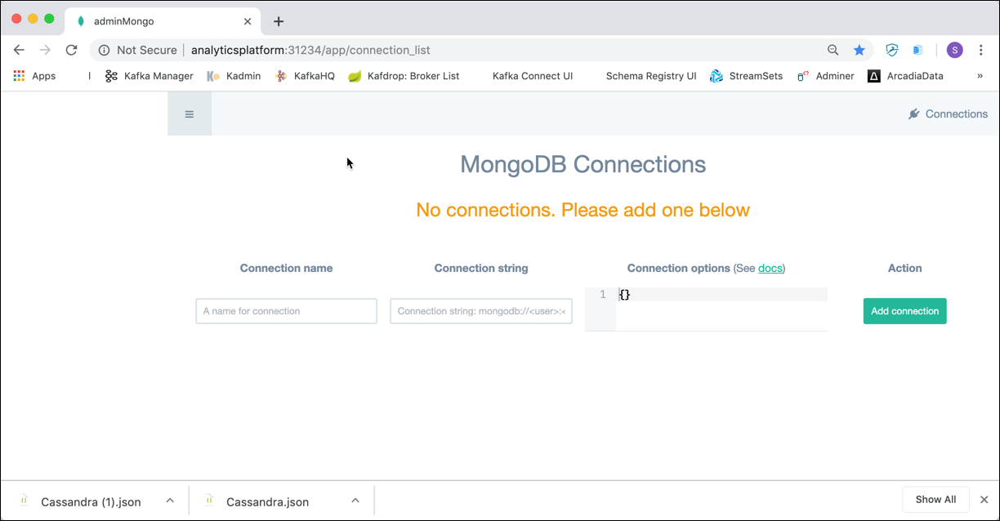

# Работа с MongoDB

В этом семинаре мы научимся использовать базу данных MongoDB NoSQL.

Мы предполагаем, что платформа, описанная [здесь](../01-environment), запущена и доступна.

## Подключение к среде MongoDB

### Использование утилиты командной строки MongoDB

Вы можете найти утилиту командной строки `mongo` внутри контейнера Docker MongoDB, работающего как часть платформы. Подключитесь по SSH к хосту Docker и выполните следующую команду `docker exec`

```
docker exec -ti mongo-1 mongosh -u "root" -p "abc123!"
```

Это позволит вам подключиться к контейнеру `mongo` и запустить оболочку `mongo` внутри него.

Вы должны увидеть вывод, аналогичный приведенному ниже.

```bash
bigdata@bigdata:~$ docker exec -ti mongo-1 mongosh -u "root" -p "abc123!"
Current Mongosh Log ID: 67b215162e08a3633d544ca6
Connecting to:          mongodb://<credentials>@127.0.0.1:27017/?directConnection=true&serverSelectionTimeoutMS=2000&appName=mongosh+2.3.8
Using MongoDB:          7.0.16
Using Mongosh:          2.3.8

For mongosh info see: https://www.mongodb.com/docs/mongodb-shell/


To help improve our products, anonymous usage data is collected and sent to MongoDB periodically (https://www.mongodb.com/legal/privacy-policy).
You can opt-out by running the disableTelemetry() command.

------
   The server generated these startup warnings when booting
   2025-02-16T16:10:32.061+00:00: Using the XFS filesystem is strongly recommended with the WiredTiger storage engine. See http://dochub.mongodb.org/core/prodnotes-filesystem
   2025-02-16T16:10:33.459+00:00: vm.max_map_count is too low
------

test> 

```

Теперь вы находитесь в командной строке MongoDB, готовой к выполнению любых операторов MongoDB. Мы также можем увидеть версию сервера MongoDB, а также оболочки MongoDB.

Оболочка запускает JavaScript. Есть несколько глобальных команд, которые вы можете выполнить, например help или exit. Команды, которые вы выполняете для текущей базы данных, выполняются для объекта db, например `db.help()` или `db.stats()`.

Команды, которые вы выполняете для определенной коллекции, что мы будем делать много раз, выполняются для объекта `db.COLLECTION_NAME`, например `db.movies.help()` или `db.movies.countDocuments()`.

Продолжайте и введите `db.help()`, вы получите список команд, которые вы можете выполнить для объекта db.

**Небольшое примечание:** Поскольку это оболочка JavaScript, если вы выполните метод и опустите скобки (), вы увидите тело метода, а не выполнение метода. Я упоминаю об этом только для того, чтобы в первый раз, когда вы сделаете это и получите ответ, начинающийся с function (...){, вы не были удивлены. Например, если вы введете db.help (без скобок), вы увидите внутреннюю реализацию метода help.

### Использование браузерного графического интерфейса

Вместо работы в командной строке и, следовательно, необходимости подключаться к Docker Host через SSH, мы также можем использовать браузерный графический интерфейс для доступа к MongoDB. В рамках платформы доступны две браузерные утилиты.

#### Mongo Express

Первый — [Mongo Express](https://github.com/mongo-express/mongo-express), веб-интерфейс администратора MongoDB, написанный с помощью Node.js, Express и Bootstrap3.

В окне браузера перейдите на <http://localhost:28203/>, и вы должны сразу попасть на главный экран, как показано ниже.


#### Admin Mongo
Второй — [Admin Mongo](https://github.com/adicom-systems/adminMongo), открытый исходный интерфейс администратора для MongoDB.

В окне браузера перейдите на <http://localhost:28204/> и войдите с именем пользователя `admin` и паролем `pass`, и вы должны увидеть главный экран, как показано ниже.



Чтобы подключиться к экземпляру MongoDB, добавьте новое подключение к Admin Mongo. Введите `Data Platform` в поле **Имя подключения** и `mongodb://mongo-1:27017` в поле **Строка подключения** и нажмите **Добавить подключение**. Должно появиться сообщение о том, что подключение было успешно добавлено.


Нажатие кнопки **Подключить** открывает страницу сведений об администрировании Mongo для подключения.

### Использование настольных приложений

Существуют также различные настольные приложения для управления и администрирования MongoDB, которые можно загрузить и установить на рабочем столе. Оттуда вы можете подключиться как к локальному, так и к удаленному экземпляру Mongo.

#### Studio 3T (ранее известная как Robo 3T или Robomongo)

То, что мы здесь показываем, это [Studio 3T](https://robomongo.org/), настольное приложение, встраивающее оболочку MongoDB. Оно доступно для Windows, Mac и Linux.


Нажмите на значок **Подключить** в левом верхнем углу и нажмите **Новое подключение**, чтобы создать новое подключение.

Введите `dataplatform` или IP-адрес вашего Docker Host в поле **Сервер**. Оставьте порт 27017 и нажмите **Сохранить**. Выбрав только что созданное подключение, нажмите **Подключить**. С правой стороны вы должны увидеть список доступных баз данных.

## Работа с MongoDB

Мы начнем наше путешествие со знакомства с основными механизмами работы с MongoDB. Очевидно, это основа для понимания MongoDB, но это также должно помочь нам ответить на вопросы более высокого уровня о том, где MongoDB подходит.

Для начала нам нужно понять шесть простых концепций.

1. MongoDB имеет ту же концепцию базы данных, с которой вы, вероятно, уже знакомы (или схему для вас, Oracle). Внутри экземпляра MongoDB у вас может быть ноль или более баз данных, каждая из которых действует как высокоуровневые контейнеры для всего остального.
2. База данных может иметь ноль или более коллекций. Коллекция имеет достаточно общего с традиционной таблицей, поэтому вы можете смело считать их одним и тем же.
3. Коллекции состоят из нуля или более документов. Опять же, документ можно смело считать строкой.
4. Документ состоит из одного или нескольких полей, которые, как вы, вероятно, можете догадаться, во многом похожи на столбцы.
5. Индексы в MongoDB функционируют в основном так же, как их аналоги в СУРБД.
6. Курсоры отличаются от пяти других концепций, но они достаточно важны и часто упускаются из виду, поэтому я считаю, что они достойны отдельного обсуждения. Важно понимать, что курсоры — это то, что когда вы запрашиваете данные у MongoDB, он возвращает указатель на результирующий набор, называемый курсором, с которым мы можем что-то делать, например, подсчитывать или пропускать, прежде чем фактически извлекать данные.

Подводя итог, MongoDB состоит из баз данных, содержащих коллекции. Коллекция состоит из документов. Каждый документ состоит из полей. Коллекции можно индексировать, что повышает производительность поиска и сортировки. Наконец, когда мы получаем данные из MongoDB, мы делаем это через курсор, фактическое выполнение которого откладывается до необходимости.

Зачем использовать новую терминологию (коллекция против таблицы, документ против строки и поле против столбца)? Просто чтобы все усложнить? Правда в том, что, хотя эти концепции похожи на свои аналоги в реляционных базах данных, они не идентичны. Основное различие заключается в том, что реляционные базы данных определяют столбцы на уровне таблицы, тогда как документоориентированная база данных определяет свои поля на уровне документа. То есть каждый документ в коллекции может иметь свой собственный уникальный набор полей. Таким образом, коллекция — это упрощенный контейнер по сравнению с таблицей, в то время как документ содержит гораздо больше информации, чем строка.

Хотя это важно понимать, не волнуйтесь, если что-то еще не ясно. Потребуется не больше пары вставок, чтобы увидеть, что это на самом деле означает. В конечном счете, суть в том, что коллекция не является строгой в отношении того, что в нее попадает (она не имеет схемы). Поля отслеживаются с каждым отдельным документом. Преимущества и недостатки этого будут рассмотрены в будущей главе.

Итак, начнем в оболочке MongoDB.

Сначала мы используем глобальный помощник use для переключения баз данных, поэтому продолжайте и введите

```
use filmdb
```

Неважно, что база данных на самом деле еще не существует. Первая коллекция, которую мы создадим, также создаст базу данных `filmdb`. Теперь, когда вы находитесь внутри базы данных, вы можете начать выполнять команды базы данных, такие как `db.getCollectionNames()`.

```
db.getCollectionNames()
```

Вы получите пустой массив, так как в базе данных `filmdb` пока нет коллекций.

Поскольку коллекции не имеют схемы, нам не нужно явно создавать их, и мы можем напрямую начать добавлять документы в коллекцию.

## Создание документов Movie в коллекции `movies`

Мы можем просто вставить документ в новую коллекцию. Для этого используйте команду `insert`, указав в ней документ для вставки:

Добавьте документ для фильма "Pulp Fiction" в коллекцию `movies`. Приведенную ниже команду можно использовать из оболочки MongoDB.

```
db.movies.insertOne (
{
"id": "0110912",
"title": "Pulp Fiction",
"year": 1994,
"runtime": 154,
"languages": ["en", "es", "fr"],
"rating": 8.9,
"votes": 2084331,
"genres": ["Crime", "Drama"],
"plotOutline": "Жюль Уиннфилд (Сэмюэл Л. Джексон) и Винсент Вега (Джон Траволта) — два киллера, которые отправляются на поиски чемодана, украденного у их работодателя, главаря мафии Марселласа Уоллеса (Винг Рэймс). Уоллес также попросил Винсента вывезти его жену Мию (Ума Турман) через несколько дней, когда сам Уоллес будет в отъезде. Бутч Кулидж (Брюс Уиллис) — стареющий боксер, которому платят Уоллесом проиграть свою битву. Жизни этих, казалось бы, не связанных между собой людей переплетены воедино, состоящие из серии забавных, странных и неуместных инцидентов.",
"coverUrl": "https://m.media-amazon.com/images/M/MV5BNGNhMDIzZTUtNTBlZi00MTRlLWFjM2ItYzViMjE3YzI5MjljXkEyXkFqcGdeQXVyNzkwMjQ5NzM@._V1_SY150_CR1,0,101,150_.jpg",
"actors": [
{ "actorID": "0000619", "name": "Тим Рот"},
{ "actorID": "0001625", "name": "Аманда Пламмер"},
{ "actorID": "0522503", "name": "Лора Лавлейс"},
{ "actorID": "0000237", "name": "Джон Траволта"},
{ "actorID": "0000168", "name": "Сэмюэл Л. Джексон"},
{ "actorID": "0482851", "name": "Фил Ламарр"},
{ "actorID": "0001844", "name": "Фрэнк Уэйли"},
{ "actorID": "0824882", "name": "Бёрр Стирс"},
{ "actorID": "0000246", "name": "Брюс Уиллис"},
{ "actorID": "0000609", "name": "Винг Рамс"},
{ "actorID": "0000235", "name": "Ума Турман"},
{ "actorID": "0000233", "name": "Квентин Тарантино"}
],
"directors": [
{ "directorID": "0000233", "name": "Квентин Тарантино"}
],
"producers": [
{ "producerID": "0004744", "name": "Лоуренс Бендер"},
{ "producerID": "0000362", "name": "Дэнни ДеВито"},
{ "producerID": "0321621", "name": "Ричард Н. Гладштейн"},
{ "producerID": "0787834", "name": "Майкл Шамберг"},
{ "producerID": "0792049", "name": "Стейси Шер"},
{ "producerID": "0918424", "name": "Bob Weinstein"},
{ "producerID": "0005544", "name": "Harvey Weinstein"}
]
})
```

После выполнения команды вы должны получить следующий результат, сообщающий, что был вставлен 1 документ.

```
{
acknowledged: true,
installedId: ObjectId('66cb796c8137d3ecf9c76a8d')
}
```

В графических инструментах в большинстве случаев вам нужно только предоставить документ JSON, без указания команды `db.movies.insertOne()`.

Приведенная выше строка выполняет вставку в коллекцию **movies**, передавая ей один параметр. Внутри MongoDB использует двоичный сериализованный формат JSON, называемый BSON. Внешне это означает, что мы часто используем JSON, как и в случае с нашими параметрами.

Давайте также добавим фильм «Матрица»

```
db.movies.insertOne (
{
"id": "0133093",
"title": "Матрица",
"year": 1999,
"runtime": 136,
"languages": ["en"],
"rating": 8.7,
"votes": 1496538,
"genres": ["Action", "Sci-Fi"],
"plotOutline": "Томас А. Андерсон — человек, живущий двумя жизнями. Днем он обычный программист, а ночью — хакер, известный как Нео. Нео всегда подвергал сомнению свою реальность, но правда находится далеко за пределами его воображения. Нео оказывается преследуемым полицией, когда с ним связывается Морфеус, легендарный компьютерный хакер, которого правительство заклеймило как террориста. Морфеус пробуждает Нео в реальном мире, разоренной пустоши, где большая часть человечества была захвачена расой машин, живущих за счет людей. тепло тела и электрохимическая энергия, которые заключают свои разумы в искусственную реальность, известную как Матрица. Как бунтарь против машин, Нео должен вернуться в Матрицу и противостоять агентам: сверхмощным компьютерным программам, призванным уничтожить Нео и все человеческое восстание.",
"coverUrl": "https://m.media-amazon.com/images/M/MV5BNzQzOTk3OTAtNDQ0Zi00ZTVkLWI0MTEtMDllZjNkYzNjNTc4L2ltYWdlXkEyXkFqcGdeQXVyNjU0OTQ0OTY@._V1_SX101_CR0,0,101,150_.jpg",
"actors": [
{ "actorID": "0000206", "name": "Киану Ривз"},
{ "actorID": "0000401", "name": "Лоренс Фишберн"},
{ "actorID": "0005251", "name": "Кэрри-Энн Мосс"},
{ "actorID": "0915989", "name": "Хьюго Уивинг"},
{ "actorID": "0287825", "name": "Глория Фостер"},
{ "actorID": "0001592", "name": "Джо Пантолиано"},
{ "actorID": "0159059", "name": "Маркус Чонг"},
{ "actorID": "0032810", "name": "Джулиан Араханга"},
{ "actorID": "0000246", "name": "Брюс Уиллис"},
{ "actorID": "0000609", "name": "Винг Rahmes"},
{ "actorID": "0000235", "name": "Ума Турман"},
{ "actorID": "0000233", "name": "Квентин Тарантино"}
],
"directors": [
{ "directorID": "0905154", "name": "Лана Вачовски"},
{ "directorID": "0905152", "name": "Лилли Вачовски"}
],
"producers": [
{ "producerID": "0075732", "name": "Брюс Берман"},
{ "producerID": "0185621", "name": "Дэн Краккиоло"},
{ "producerID": "0400492", "name": "Кэрол Хьюз"}
]
})
```

Если мы выполним `db.getCollectionNames()` теперь мы должны увидеть коллекцию, в которую мы только что добавили документы

```
> db.getCollectionNames()
[ 'movies' ]
```

Теперь вы можете использовать команду `find` для коллекции **movies**, чтобы вернуть список документов:

```
db.movies.find()
```

На самом деле мы выполняем этот оператор.

```
db.movies.find({})
```

Вы можете видеть, что пустой документ передается в качестве параметра. Этот документ позже будет содержать фактический запрос для выполнения ограничения на возвращаемые документы. Пустой документ просто означает возврат всех и является значением по умолчанию.

Чтобы отобразить результаты в красиво отформатированном виде, вы можете использовать метод `pretty()`

```
db.movies.find().pretty()
```

Обратите внимание, что в дополнение к указанным вами данным есть поле `_id`. Каждый документ должен иметь уникальное поле идентификатора.
Вы можете либо сгенерировать его самостоятельно, либо позволить MongoDB сгенерировать для вас значение, которое имеет тип `ObjectId`. В большинстве случаев вы, вероятно, захотите позволить MongoDB сгенерировать его для вас. По умолчанию поле `_id` индексируется, что можно проверить с помощью команды `db.persons.getIndexes()`

```
> db.movies.getIndexes()
[ { "v" : 2, "key" : { "_id" : 1 }, "name" : "_id_" } ]
```

Вы видите имя индекса, базу данных и коллекцию, в которой он был создан, а также поля, включенные в индекс.

