# Работа с Neo4J


На этом занятии научимся использовать базу данных NoSQL Neo4J.

Предполагается, что платформа, описанная [здесь](../01-environment/README.md), запущена и доступна.

В рамках этого занятия вы узнаете, как использовать Neo4J для выполнения запросов, визуализации и взаимодействия с данными. [Neo4J Browser](https://neo4j.com/developer/guide-neo4j-browser/) является частью Neo4J и предлагает веб-интерфейс для добавления данных, выполнения запросов, создания связей и многого другого. Он также предоставляет удобный способ визуализации данных в базе данных.


## Подключение к Cypher Shell (необязательно)

Для использования `cypher-shell` выполните в терминальном окне следующую команду:

```bash
sudo docker exec -ti neo4j-1 ./bin/cypher-shell -u neo4j -p abc123abc123
```

и вы должны увидеть приглашение командной строки Neo4J:

```bash
dev@dev-vm:~/Downloads/dba/nonrel/neo4j$ sudo docker exec -ti neo4j-1 ./bin/cypher-shell -u neo4j -p abc123abc123
Connected to Neo4j using Bolt protocol version 5.7 at neo4j://localhost:7687 as user neo4j.
Type :help for a list of available commands or :exit to exit the shell.
Note that Cypher queries must end with a semicolon.
```

Введите `:help`, чтобы получить список доступных команд.

```bash
neo4j@neo4j> :help

Available commands:
  :begin       Open a transaction
  :commit      Commit the currently open transaction
  :connect     Connects to a database
  :disconnect  Disconnects from database
  :exit        Exit the logger
  :help        Show this help message
  :history     Statement history
  :impersonate Impersonate user
  :param       Set the value of a query parameter
  :rollback    Rollback the currently open transaction
  :source      Executes Cypher statements from a file
  :use         Set the active database

Для получения справки по конкретной команде введите:
    :help command

Keyboard shortcuts:
    Up and down arrows to access statement history.
    Tab for autocompletion of commands, hit twice to select suggestion from list using arrow keys.

For help on cypher please visit:
    https://neo4j.com/docs/cypher-manual/current/
```

Вы также можете выполнять любые корректные операторы Cypher.

Введите `:exit`, чтобы выйти из командной строки.

В рамках мастер-класса мы будем использовать Neo4J Browser, так как он предоставляет удобный способ загрузки учебной базы данных.

## Подключение через Neo4J Browser

В окне браузера перейдите по адресу <http://localhost:7474>, и сразу окажетесь на экране входа в Neo4j Browser.

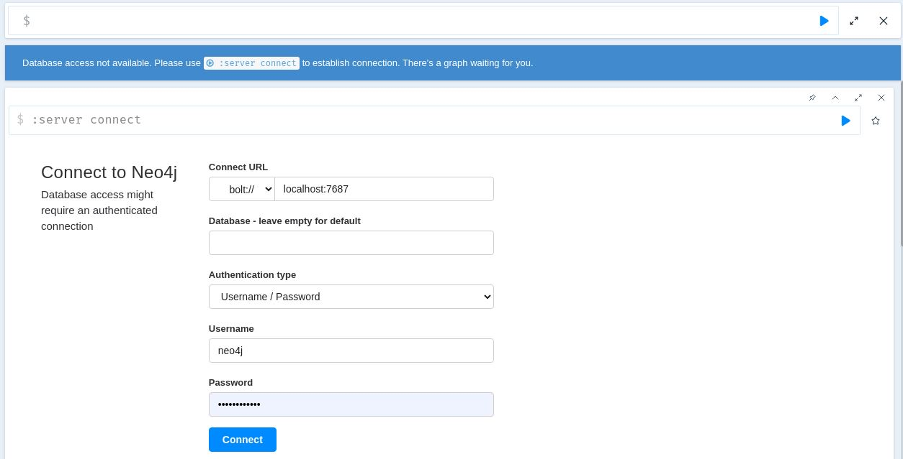

Введите `bolt://dataplatform:7687` в поле **Connect URL** (URL подключения), `neo4j` в поле **Username** (Имя пользователя) и `abc123abc123` в поле **Password** (Пароль), затем нажмите кнопку **Connect** (Подключиться).

При успешном подключении вы должны увидеть страницу, аналогичную показанной ниже:

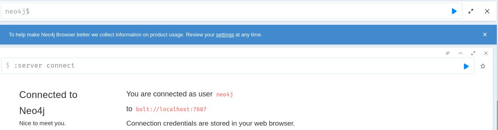

Neo4j поставляется с встроенным учебником, которые предоставляют простой способ загрузки данных в граф и дальнейшего использования этого графа для практики запросов к базе данных.

В верхней панели введите `:play movie graph`, чтобы начать работать с учебным пособием **Movie Graph** (Граф фильмов).

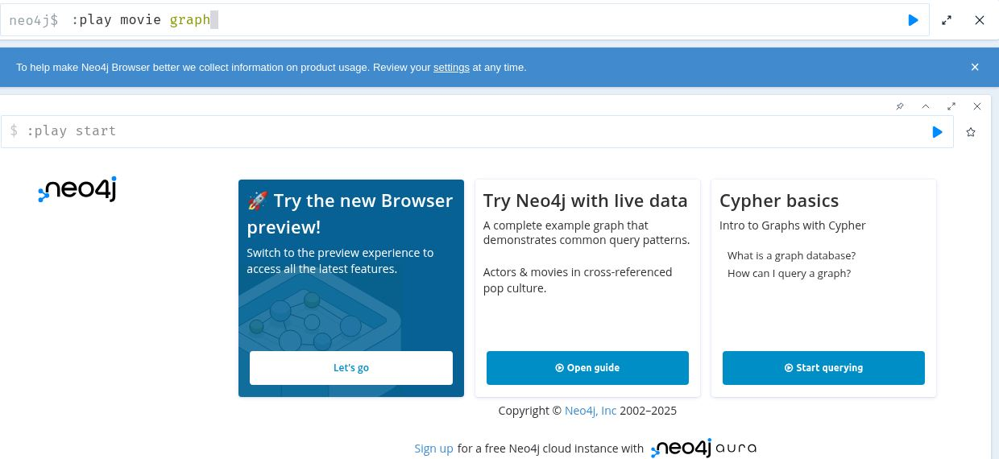

Execute the statement by either hitting ENTER or click on the play arrow on the top right corner.

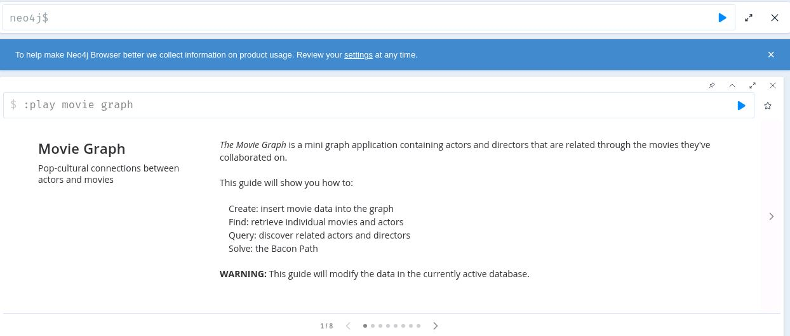

## Загрузка графа фильмов

Используйте закрепление (-pin) на панели Movie Graph, чтобы закрепить эту панель сверху. Мы будем следовать инструкциям в этом окне пошагово. Нажмите на следующий шаг в навигационной панели внизу, чтобы перейти к 2/8.

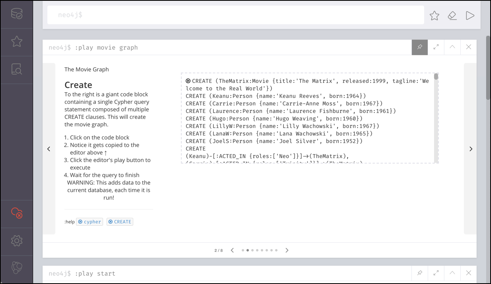

Нажмите на маленькую стрелку слева от команды `CREATE ..`, и она должна появиться в верхней панели.

Выполните команду `CREATE ..`, чтобы создать граф фильмов и добавить некоторые пробные данные о фильмах.

Прежде чем продолжить со следующим шагом, давайте посмотрим, как выглядит граф. Нажмите на иконку базы данных в левом верхнем углу браузера Neo4j.

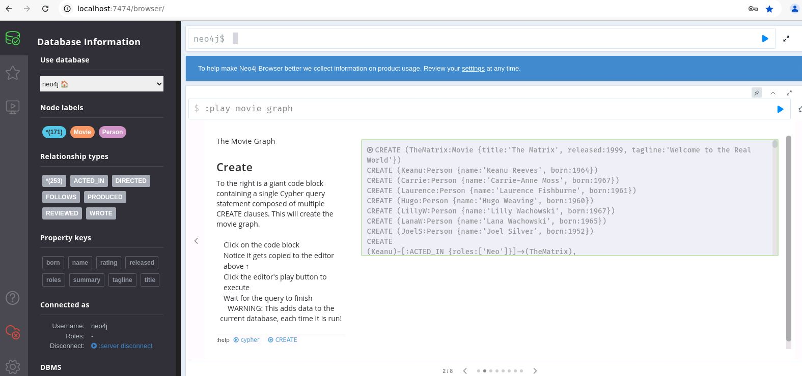

Мы можем увидеть различные **Node Labels**, **Relationship Types** и **Property Keys**, которые были созданы для графа фильмов, а также сколько их создано для каждого типа.

## Примеры запросов

Перейдите к шагу 3/8, чтобы найти несколько примеров операторов `Cypher` для поиска информации в графе.

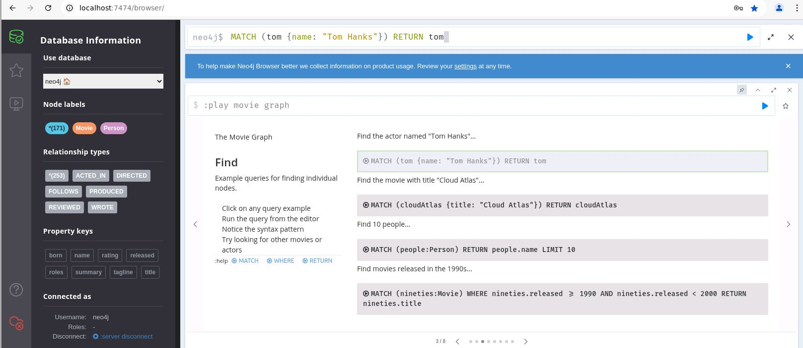

Первый запрос находит актёра по имени "Том Хэнкс".


```cypher
MATCH (tom {name: "Tom Hanks"}) RETURN tom
```

Execute it and scroll down to see the result in a graphical way. 

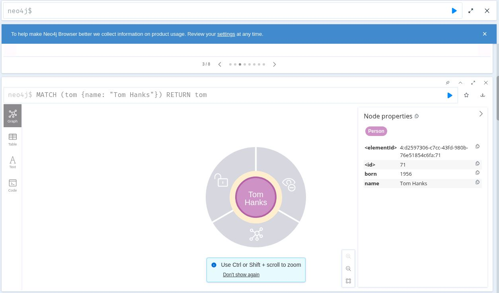

We have only matched on a single Person, therefore only a single node is shown. 

Not let's find the movie with title "Cloud Atlas"...

```
MATCH (cloudAtlas {title: "Cloud Atlas"}) RETURN cloudAtlas
```

The result is similar to the one before, but this time another type of node, a **Movie** node is returned and that's why it is shown in another color. You can click on a node and expand the relationship from/to the **Cloud Atlas** movie node.

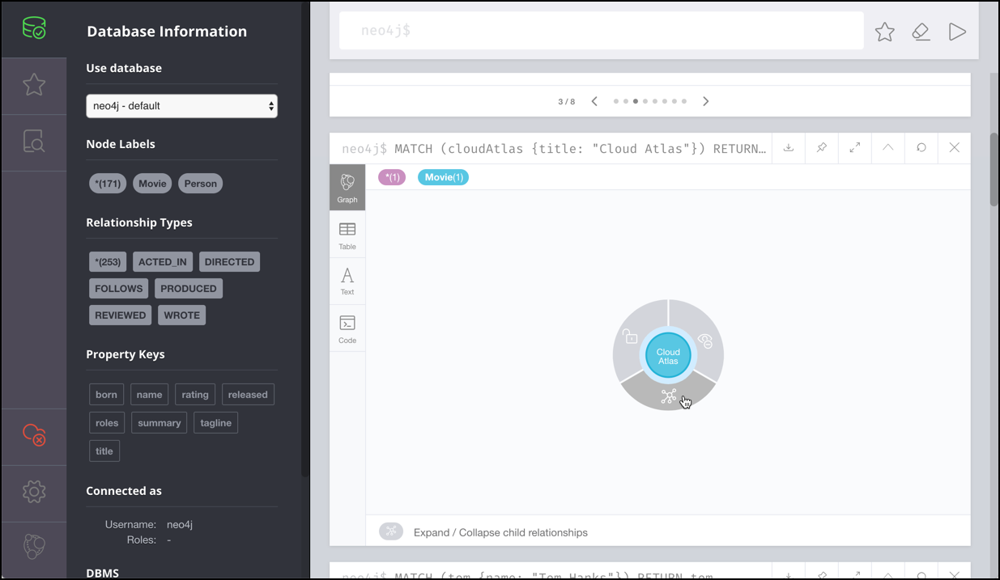

Click on expand and you see all nodes related to the movie node

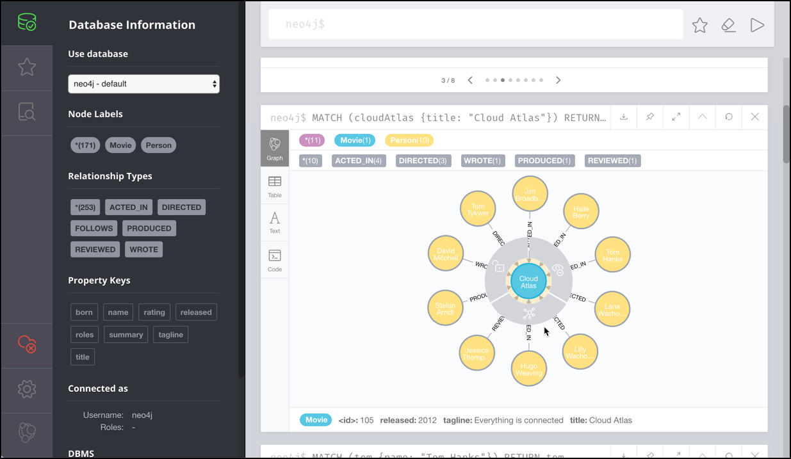

We can see that these are all of type Person (shown by all having the same color). 

Continue with the other statements on the step 3/8 panel and then continue with the other panels. 

You will see many interesting queries, showing the power of a graph database, such as

Show Tom Hanks' co-actors:

```
MATCH (tom:Person {name:"Tom Hanks"})-[:ACTED_IN]->(m)<-[:ACTED_IN]-(coActors) RETURN coActors.name
```

or the Bacon path, the shortest path of any relationships to Meg Ryan

```
MATCH p=shortestPath(
(bacon:Person {name:"Kevin Bacon"})-[*]-(meg:Person {name:"Meg Ryan"})
)
RETURN p
```

the result will show the shortest path from Kevin Bacon to Meg Ryan

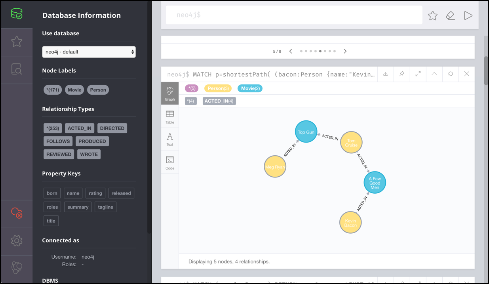


