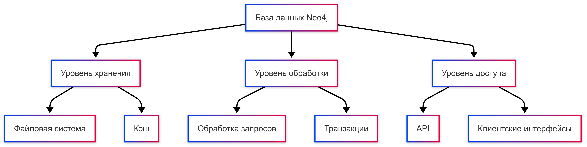

# Работа с Neo4J

На этом занятии научимся использовать базу данных NoSQL Neo4J.

Предполагается, что платформа, описанная [здесь](../01-environment/README.md), запущена и доступна.

В рамках этого занятия вы узнаете, как использовать Neo4J для выполнения запросов, визуализации и взаимодействия с данными. [Neo4J Browser](https://neo4j.com/developer/guide-neo4j-browser/) является частью Neo4J и предлагает веб-интерфейс для добавления данных, выполнения запросов, создания связей и многого другого. Он также предоставляет удобный способ визуализации данных в базе данных.


## 1. Основные компоненты графовой модели

### Узлы (Nodes)
- Представляют сущности в графе.
- Могут иметь метки (labels) для категоризации.
- Содержат свойства (properties) - пары ключ-значение.

```cypher
CREATE (n:Person {name: 'John', age: 30})
```

### Отношения (Relationships)
- Соединяют узлы между собой.
- Всегда имеют направление и тип.
- Могут содержать свойства.

  ```cypher
  CREATE (a:Person)-[r:KNOWS {since: 2020}]->(b:Person)
  ```

### Свойства (Properties)
- Атрибуты узлов и отношений
- Поддерживаемые типы данных:
  - Числовые (Integer, Float).
  - Строковые (String).
  - Логические (Boolean).
  - Списки (Lists).
  - Временные метки (DateTime).

## 2. Диаграмма базовой архитектуры


    
## 3. Этапы создания базы данных

### 3.1 Планирование модели данных
1. Определение основных сущностей (узлов).
2. Определение связей между сущностями.
3. Проектирование схемы свойств.
4. Определение индексов и ограничений.


## 4. Лучшие практики моделирования

### 4.1 Правила именования
- Узлы: существительные в PascalCase (Person, Product).
- Отношения: глаголы в UPPER_SNAKE_CASE (KNOWS, HAS_BOUGHT).
- Свойства: camelCase (firstName, dateOfBirth).

### 4.2 Оптимизация производительности
1. Создание индексов для часто запрашиваемых свойств.
2. Использование MERGE вместо CREATE для предотвращения дубликатов.
3. Использование параметризованных запросов.
4. Правильное использование MATCH и WHERE.

### 4.3 Инструменты работы с Neo4j

- Neo4j Browser: веб-интерфейс для выполнения запросов.
- Neo4j Bloom: визуализация и исследование графов.
- Neo4j Data Importer: импорт данных из CSV/JSON.
- Cypher Shell: командная строка для работы с базой.
- Neo4j Desktop: локальное управление базами данных.

## Подключение к Cypher Shell (необязательно)

Для использования `cypher-shell` выполните в терминальном окне следующую команду:

```bash
sudo docker exec -ti neo4j-1 ./bin/cypher-shell -u neo4j -p abc123abc123
```

и вы должны увидеть приглашение командной строки Neo4J:

```bash
dev@dev-vm:~/Downloads/dba/nonrel/neo4j$ sudo docker exec -ti neo4j-1 ./bin/cypher-shell -u neo4j -p abc123abc123
Connected to Neo4j using Bolt protocol version 5.7 at neo4j://localhost:7687 as user neo4j.
Type :help for a list of available commands or :exit to exit the shell.
Note that Cypher queries must end with a semicolon.
```

Введите `:help`, чтобы получить список доступных команд.

```bash
neo4j@neo4j> :help

Available commands:
  :begin       Open a transaction
  :commit      Commit the currently open transaction
  :connect     Connects to a database
  :disconnect  Disconnects from database
  :exit        Exit the logger
  :help        Show this help message
  :history     Statement history
  :impersonate Impersonate user
  :param       Set the value of a query parameter
  :rollback    Rollback the currently open transaction
  :source      Executes Cypher statements from a file
  :use         Set the active database

Для получения справки по конкретной команде введите:
    :help command

Keyboard shortcuts:
    Up and down arrows to access statement history.
    Tab for autocompletion of commands, hit twice to select suggestion from list using arrow keys.

For help on cypher please visit:
    https://neo4j.com/docs/cypher-manual/current/
```

Вы также можете выполнять любые корректные операторы Cypher.

Введите `:exit`, чтобы выйти из командной строки.

В рамках занятия будем использовать Neo4J Browser, так как он предоставляет удобный способ загрузки учебной базы данных.

## Подключение через Neo4J Browser

В окне браузера перейдите по адресу <http://localhost:7474>, и сразу окажетесь на экране входа в Neo4j Browser.


Введите `bolt://localhost:7687` в поле **Connect URL** (URL подключения), `neo4j` в поле **Username** (Имя пользователя) и `abc123abc123` в поле **Password** (Пароль), затем нажмите кнопку **Connect** (Подключиться).

При успешном подключении вы должны увидеть страницу, аналогичную показанной ниже:


Neo4j поставляется со встроенным учебником, которые предоставляют простой способ загрузки данных в граф и дальнейшего использования этого графа для практики запросов к базе данных.

В верхней панели введите `:play movie graph`, чтобы начать работать с учебным пособием **Movie Graph** (Граф фильмов).


## Граф фильмов

### Культурные связи между актёрами и фильмами

Граф фильмов — это мини-графическое приложение, содержащее информацию об актёрах и режиссёрах, связанных между собой через фильмы, над которыми они работали вместе.

Этот гайд покажет вам, как:

- **Создавать**: вставлять данные о фильмах в граф.
- **Искать**: извлекать информацию о конкретных фильмах и актёрах.
- **Выполнять запросы**: находить связанных актёров и режиссёров.
- **Решать**: задачу о "Бейконовской дистанции" (Bacon Path).

> **ПРЕДУПРЕЖДЕНИЕ**: Этот гайд будет вносить изменения в данные текущей активной базы данных.

---

Выполните запрос, нажав клавишу ENTER или кликнув на стрелку воспроизведения в правом верхнем углу.


## Загрузка графа фильмов

Используйте закрепление (-pin) на панели Movie Graph, чтобы закрепить эту панель сверху. Мы будем следовать инструкциям в этом окне пошагово. Нажмите на следующий шаг в навигационной панели внизу, чтобы перейти к 2/8.


Нажмите на маленькую стрелку слева от команды `CREATE ..`, и она должна появиться в верхней панели.

Выполните команду `CREATE ..`, чтобы создать граф фильмов и добавить некоторые пробные данные о фильмах.

Прежде чем продолжить со следующим шагом, давайте посмотрим, как выглядит граф. Нажмите на иконку базы данных в левом верхнем углу браузера Neo4j.


Мы можем увидеть различные **Node Labels**, **Relationship Types** и **Property Keys**, которые были созданы для графа фильмов, а также сколько их создано для каждого типа.

## Примеры запросов

Перейдите к шагу 3/8, чтобы найти несколько примеров операторов `Cypher` для поиска информации в графе.


Первый запрос находит актёра по имени "Том Хэнкс".


```cypher
MATCH (tom {name: "Tom Hanks"}) RETURN tom
```

Выполните его и прокрутите вниз, чтобы увидеть результат в графическом виде.


Так как мы выполнили сопоставление только для одного человека (Person), отображается всего один узел.

Теперь найдём фильм с названием "Cloud Atlas" ...

```cypher
MATCH (cloudAtlas {title: "Cloud Atlas"}) RETURN cloudAtlas
```

The result is similar to the one before, but this time another type of node, a **Movie** node is returned and that's why it is shown in another color. You can click on a node and expand the relationship from/to the **Cloud Atlas** movie node.


Нажмите на кнопку "Развернуть" (expand), и вы увидите все узлы, связанные с узлом фильма.


Мы видим, что все они относятся к типу Person (что показывается одинаковым цветом).

Выполните все запросы на панели 3/8, а затем переходите к другим панелям.

Вы увидите множество интересных запросов, демонстрирующих мощь графовых баз данных. Например:

Покажите партнёров по съёмкам Тома Хэнкса:

```cypher
MATCH (tom:Person {name:"Tom Hanks"})-[:ACTED_IN]->(m)<-[:ACTED_IN]-(coActors) RETURN coActors.name
```

Или найдите "Бейконовскую цепочку" — самый короткий путь через любые отношения к  `Meg Ryan`.

```cypher
MATCH p=shortestPath(
(bacon:Person {name:"Kevin Bacon"})-[*]-(meg:Person {name:"Meg Ryan"})
)
RETURN p
```

Результат покажет самый короткий путь от Kevin Bacon до `Meg Ryan`.


## Индивидуальные задания

---
### Описание задачи, её цели и инструментов

#### **Цель задачи**
Основной целью данной работы является изучение и практическое применение баз данных типа граф (Graph Database) на примере системы **Neo4j**. Студенты должны научиться создавать, заполнять и анализировать графовые структуры данных, а также выполнять запросы для получения необходимой информации. Задача помогает развить навыки работы с реальными данными в контексте бизнес-информатики, такие как управление проектами, взаимодействие между компаниями, сотрудниками и клиентами.

#### **Задачи работы**
1. Создание графовой базы данных на основе предоставленных данных о компаниях, сотрудниках, проектах и клиентах.
2. Написание запросов для выполнения заданий по анализу данных.
3. Практическое освоение языка запросов **Cypher**, используемого в Neo4j.
4. Формирование умений работать с различными типами отношений между узлами графа.

---

### **Инструменты**

Для выполнения работы используются следующие инструменты:
1. **Neo4j Desktop/Cloud**: графовая база данных, позволяющая создавать, заполнять и анализировать данные в виде графов.
2. **Cypher Query Language**: язык запросов, используемый для работы с данными в Neo4j.
3. **Neo4j Browser**: интерфейс для выполнения запросов и визуализации графовых данных.
4. **CSV-файлы или текстовые данные**: для загрузки исходных данных о компаниях, сотрудниках, проектах и клиентах.

---

### **Необходимые документы после выполнения работы**

После завершения работы студент должен предоставить следующие материалы:

1. **Отчет о работе**:
   - Краткое описание процесса создания базы данных.
   - Перечень выполненных запросов для каждого задания.
   - Результаты выполнения запросов (включая скриншоты и текстовые выводы).
   - Выводы о проделанной работе: что было изучено, какие сложности возникли и как они были преодолены.

2. **Файл с запросами Cypher**:
   - Текстовый файл или скрипт, содержащий все написанные запросы для выполнения заданий.
   - Комментарии к каждому запросу, объясняющие его логику.

3. **Скриншоты графов**:
   - Визуальные представления графов до и после выполнения запросов.
   - Примеры визуализации связей между компаниями, сотрудниками, проектами и клиентами.

4. **Архив с базой данных**:
   - Экспорт созданной базы данных из Neo4j (в формате `.dump` или `.graphdb`) для проверки преподавателем.

---


#### Структура графа
Используем следующие типы узлов и отношений:

- **Узлы**:
  - `Company` (Компания)
  - `Employee` (Сотрудник)
  - `Project` (Проект)
  - `Client` (Клиент)

- **Отношения**:
  - `WORKS_AT` (Сотрудник работает в компании)
  - `MANAGES` (Сотрудник управляет проектом)
  - `PARTICIPATES_IN` (Сотрудник участвует в проекте)
  - `HAS_PROJECT` (Компания имеет проект)
  - `IS_CLIENT_OF` (Клиент связан с проектом)

---

#### Данные для загрузки

#### Компании (`Company`)
| id | name       | industry   |
|----|------------|------------|
| 1  | ABC Corp   | IT         |
| 2  | XYZ Inc    | Finance    |
| 3  | DEF Ltd    | Retail     |
| 4  | GHI Group  | Manufacturing |
| 5  | JKL Co     | Healthcare |

#### Сотрудники (`Employee`)
| id | name        | position      | company_id |
|----|-------------|---------------|------------|
| 1  | John Doe    | Developer     | 1          |
| 2  | Jane Smith  | Manager       | 2          |
| 3  | Alice Brown | Analyst       | 3          |
| 4  | Bob Green   | Engineer      | 4          |
| 5  | Carol White | Designer      | 5          |
| 6  | David Black | Developer     | 1          |
| 7  | Emily Gray  | Manager       | 2          |
| 8  | Frank Red   | Analyst       | 3          |
| 9  | Grace Blue  | Engineer      | 4          |
| 10 | Helen Pink  | Designer      | 5          |

#### Проекты (`Project`)
| id | name         | start_date  | end_date    | company_id |
|----|--------------|-------------|-------------|------------|
| 1  | Project X    | 2023-01-01  | 2023-06-01  | 1          |
| 2  | Project Y    | 2023-02-01  | 2023-07-01  | 2          |
| 3  | Project Z    | 2023-03-01  | 2023-08-01  | 3          |
| 4  | Project A    | 2023-04-01  | 2023-09-01  | 4          |
| 5  | Project B    | 2023-05-01  | 2023-10-01  | 5          |
| 6  | Project C    | 2023-06-01  | 2023-11-01  | 1          |
| 7  | Project D    | 2023-07-01  | 2023-12-01  | 2          |
| 8  | Project E    | 2023-08-01  | 2024-01-01  | 3          |
| 9  | Project F    | 2023-09-01  | 2024-02-01  | 4          |
| 10 | Project G    | 2023-10-01  | 2024-03-01  | 5          |

#### Клиенты (`Client`)
| id | name       | project_id |
|----|------------|------------|
| 1  | Client A   | 1          |
| 2  | Client B   | 2          |
| 3  | Client C   | 3          |
| 4  | Client D   | 4          |
| 5  | Client E   | 5          |
| 6  | Client F   | 6          |
| 7  | Client G   | 7          |
| 8  | Client H   | 8          |
| 9  | Client I   | 9          |
| 10 | Client J   | 10         |

#### Участие в проектах (`Project_Participation`)
| employee_id | project_id | role            |
|-------------|------------|-----------------|
| 1           | 1          | Lead Developer |
| 2           | 2          | Project Manager |
| 3           | 3          | Data Analyst    |
| 4           | 4          | Software Engineer |
| 5           | 5          | UX Designer     |
| 6           | 6          | Junior Developer |
| 7           | 7          | Team Leader     |
| 8           | 8          | Business Analyst |
| 9           | 9          | DevOps Engineer  |
| 10          | 10         | Graphic Designer |

---

#### Загрузка данных в Neo4j

Используйте следующие Cypher-запросы для создания узлов и отношений:

##### Создание компаний
```cypher
CREATE (:Company {id: 1, name: "ABC Corp", industry: "IT"}),
       (:Company {id: 2, name: "XYZ Inc", industry: "Finance"}),
       (:Company {id: 3, name: "DEF Ltd", industry: "Retail"}),
       (:Company {id: 4, name: "GHI Group", industry: "Manufacturing"}),
       (:Company {id: 5, name: "JKL Co", industry: "Healthcare"});
```

##### Создание сотрудников
```cypher
CREATE (:Employee {id: 1, name: "John Doe", position: "Developer", company_id: 1}),
       (:Employee {id: 2, name: "Jane Smith", position: "Manager", company_id: 2}),
       (:Employee {id: 3, name: "Alice Brown", position: "Analyst", company_id: 3}),
       (:Employee {id: 4, name: "Bob Green", position: "Engineer", company_id: 4}),
       (:Employee {id: 5, name: "Carol White", position: "Designer", company_id: 5}),
       (:Employee {id: 6, name: "David Black", position: "Developer", company_id: 1}),
       (:Employee {id: 7, name: "Emily Gray", position: "Manager", company_id: 2}),
       (:Employee {id: 8, name: "Frank Red", position: "Analyst", company_id: 3}),
       (:Employee {id: 9, name: "Grace Blue", position: "Engineer", company_id: 4}),
       (:Employee {id: 10, name: "Helen Pink", position: "Designer", company_id: 5});
```

##### Создание проектов
```cypher
CREATE (:Project {id: 1, name: "Project X", start_date: "2023-01-01", end_date: "2023-06-01", company_id: 1}),
       (:Project {id: 2, name: "Project Y", start_date: "2023-02-01", end_date: "2023-07-01", company_id: 2}),
       (:Project {id: 3, name: "Project Z", start_date: "2023-03-01", end_date: "2023-08-01", company_id: 3}),
       (:Project {id: 4, name: "Project A", start_date: "2023-04-01", end_date: "2023-09-01", company_id: 4}),
       (:Project {id: 5, name: "Project B", start_date: "2023-05-01", end_date: "2023-10-01", company_id: 5}),
       (:Project {id: 6, name: "Project C", start_date: "2023-06-01", end_date: "2023-11-01", company_id: 1}),
       (:Project {id: 7, name: "Project D", start_date: "2023-07-01", end_date: "2023-12-01", company_id: 2}),
       (:Project {id: 8, name: "Project E", start_date: "2023-08-01", end_date: "2024-01-01", company_id: 3}),
       (:Project {id: 9, name: "Project F", start_date: "2023-09-01", end_date: "2024-02-01", company_id: 4}),
       (:Project {id: 10, name: "Project G", start_date: "2023-10-01", end_date: "2024-03-01", company_id: 5});
```

##### Создание клиентов
```cypher
CREATE (:Client {id: 1, name: "Client A", project_id: 1}),
       (:Client {id: 2, name: "Client B", project_id: 2}),
       (:Client {id: 3, name: "Client C", project_id: 3}),
       (:Client {id: 4, name: "Client D", project_id: 4}),
       (:Client {id: 5, name: "Client E", project_id: 5}),
       (:Client {id: 6, name: "Client F", project_id: 6}),
       (:Client {id: 7, name: "Client G", project_id: 7}),
       (:Client {id: 8, name: "Client H", project_id: 8}),
       (:Client {id: 9, name: "Client I", project_id: 9}),
       (:Client {id: 10, name: "Client J", project_id: 10});
```

##### Создание отношений
```cypher
MATCH (e:Employee), (c:Company)
WHERE e.company_id = c.id
CREATE (e)-[:WORKS_AT]->(c);

MATCH (p:Project), (c:Company)
WHERE p.company_id = c.id
CREATE (c)-[:HAS_PROJECT]->(p);

MATCH (e:Employee), (p:Project)
WHERE (e.id = 1 AND p.id = 1) OR (e.id = 2 AND p.id = 2) OR (e.id = 3 AND p.id = 3) OR (e.id = 4 AND p.id = 4) OR (e.id = 5 AND p.id = 5)
CREATE (e)-[:PARTICIPATES_IN {role: CASE WHEN e.id = 1 THEN "Lead Developer" WHEN e.id = 2 THEN "Project Manager" WHEN e.id = 3 THEN "Data Analyst" WHEN e.id = 4 THEN "Software Engineer" WHEN e.id = 5 THEN "UX Designer" END}]->(p);

MATCH (c:Client), (p:Project)
WHERE c.project_id = p.id
CREATE (c)-[:IS_CLIENT_OF]->(p);
```

---

### Задания для студентов

Варианты заданий представлены на платформе [Практическая работа 4. Графовая аналитика данных с использованием Neo4j: анализ связей и построение рекомендательных систем](http://95.131.149.21/moodle/mod/assign/view.php?id=1290)

### **Пример содержания отчета**

#### 1. Введение
- Цель работы.
- Краткое описание используемых данных и их структуры.

#### 2. Процесс выполнения
- Описание шагов создания базы данных:
  - Создание узлов (`Company`, `Employee`, `Project`, `Client`).
  - Создание отношений (`WORKS_AT`, `MANAGES`, `PARTICIPATES_IN`, `HAS_PROJECT`, `IS_CLIENT_OF`).
- Примеры выполненных запросов для каждого задания.

#### 3. Результаты
- Ответы на вопросы из 30 вариантов заданий.
- Визуализация результатов в графическом формате.

#### 4. Выводы
- Что было изучено?
- Какие сложности возникли и как они были решены?
- Какие навыки были получены?

---

### **Пример задания и ответа**

#### Задание:
*Найдите всех сотрудников компании "ABC Corp".*

#### Решение:
```cypher
MATCH (e:Employee)-[:WORKS_AT]->(c:Company {name: "ABC Corp"})
RETURN e.name AS EmployeeName
```

#### Результат:
| EmployeeName |
|-------------|
| John Doe    |
| David Black |


