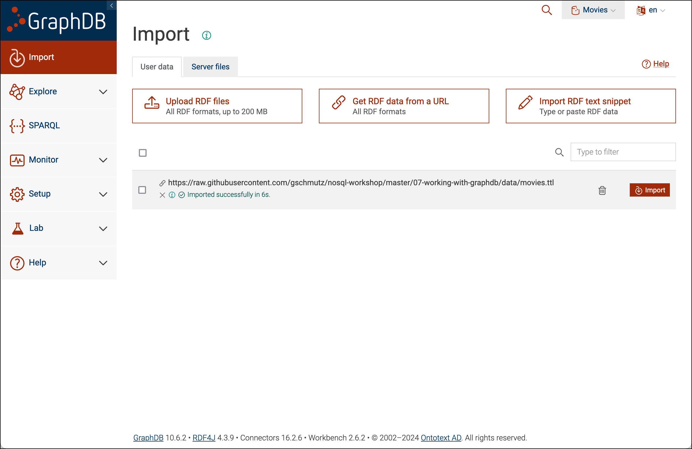

# Работа с GraphDB

В этом практическом занятии мы узнаем, как использовать базу данных `Ontotext GraphDB NoSQL`.

Предполагается, что платформа, описанная [здесь](../01-environment/README.md), запущена и доступна.

На этом занятии вы узнаете, как загружать данные в формате `RDF` в `GraphDB`, а затем использовать язык запросов `SPARQL` для выполнения запросов к данным.

## Загрузка RDF данных

Мы будем использовать данные о фильмах, взятые из учебного пособия, предоставленного GraphDB. Данные доступны в синтаксисе Turtle, распространённом формате для хранения RDF данных, в проекте на GitHub по ссылке <https://raw.githubusercontent.com/gschmutz/nosql-workshop/master/07-working-with-graphdb/data/movies.ttl>. Если вы нажмёте на ссылку, увидите данные, представленные ниже.


Мы будем использовать GraphDB Workbench для загрузки данных. В браузере перейдите по адресу <http://localhost:17200>, чтобы открыть GraphDB Workbench.


Нажмите на **Create new repository** и выберите **GraphDB Repository**.


Введите `Movies` в поле **Repository** 


и нажмите **Create**.

В меню слева нажмите на **Import**.


Нажмите на **Movies** и выберите второй вариант **Get RDF data from a URL**.


В появившемся окне введите [`https://raw.githubusercontent.com/BosenkoTM/nosql-workshop/refs/heads/main/07-working-with-graphdb/data/movies.ttl`](https://raw.githubusercontent.com/BosenkoTM/nosql-workshop/refs/heads/main/07-working-with-graphdb/data/movies.ttl) в поле.


Оставьте выбранным **Start import automatically** и нажмите **Import**. Оставьте значения по умолчанию в другом всплывающем окне и снова нажмите **Import**.

Через несколько секунд ввод должен завершиться успешным сообщением, как показано на следующем снимке экрана.



Now the database is ready to be used.

## Exploring the graph

Click on **Explore** and **Class hierarchy**


We can see the schema of the movies graph with the `schema:Movie` base class and the two subclasses `imbd:BlackAndWhiteMovie` and `imdb:ColorMovie`.

Click on the larger, inner circle, representing the color movies


We can see that there are 4'690 instances of color movies in the graph, with a selection of a a few movie titles displayed to the right. 

You can either directly click on one of the titles shown or use the search to find a certain movie. Let's type in `matrix` 


to find the movie **TheMatrix**. Click on it and you will see the triples listed belonging to this movie. 


Click on **Visual Graph** to see the graph visually


The beauty of the Visual Graph is that you can double click on one of the nodes to expand the graph. Let's try that on the Actor **KeanuReeves** and the graph should expand like shown below


We can see all the other movies Keanu Reeves also acted in. 

Navigating in the graph like that has some potential, but first we need to find a starting node in our graph. For that an RDF / Triple store offers the SPARQL query language.

## Querying the graph using SPARQL

Click on SPARQL in the navigation menu to the left and we will get to the SPARQL view which integrates the [YASGUI query editor](http://about.yasgui.org/).


The most basic SPARQL select statement is pre-filled in the query window.

```sparql
select * where {
    ?s ?p ?o .
} limit 100
```

Click **Run** to run the query. It's selecting all the triples in the graph but limiting the result to 100 results. 


If we want to only show triples with a certain subject, we can adapt the query like that

```sparql
select * where {
    <http://academy.ontotext.com/imdb/title/PiratesoftheCaribbeanAtWorldsEnd> ?p ?o .
}
```

The query selects RDF statements whose subject is the movie Pirates of the Caribbean At World's End (identified by the IRI `http://academy.ontotext.com/imdb/title/TheBourneUltimatum`). 


We can shorten the IRIs with setting a prefix like shown here

```sparql
PREFIX imdb: <http://academy.ontotext.com/imdb/>

select * where {
    imdb:title\/PiratesoftheCaribbeanAtWorldsEnd ?p ?o .
}
```

This is more useful if the same prefix is used multiple times.

Note that we need to escape the / in the shortened IRI.

The variables ?p and ?o correspond to the predicate and object of the RDF statements. We can see that the director (via the predicate `schema:director`) is identified by the IRI `imdb:person/GoreVerbinski` (scroll down if necessary).


The next query selects all color movies by class (`a` is a short-hand notation for `rdf:type`) and then performs two joins to fetch the movie's name (via the `schema:name` predicate), and the movie's number of comments (via the `schema:commentCount` predicate). Finally, the result must be ordered by the number of comments in descending order.

```sparql
PREFIX imdb: <http://academy.ontotext.com/imdb/>
PREFIX schema: <http://schema.org/>

SELECT * { 
    ?movie a imdb:ColorMovie ;
           schema:name ?movieName ;
           schema:commentCount ?commentCount .
} ORDER BY DESC(?commentCount)
```

The table shows the results from executing the query.


The variables `?movie`, `?movieName` and `?commentCount` contain each movie's IRI, name and number of comments respectively. We can see that the movie with the most comments, The Dark Knight Rises, comes on top.


The next query selects RDF statements that have the same subject (`?movie`) and the same object (`?person`). 
For any given movie and person, there must be RDF statements that link the movie and the person with both the `schema:director` and the `imdb:leadActor` predicate.

```sparql
PREFIX schema: <http://schema.org/>
PREFIX imdb: <http://academy.ontotext.com/imdb/>

SELECT * { 
	?movie schema:director ?person ;
           imdb:leadActor ?person .
} ORDER BY ?person
```

The table shows the results from executing the query.


Just like the previous query, in the next query we select movies and people that are both the leading actor and the director. In this query, we also use `GROUP BY ?person` to group the results by person and `COUNT(?movie)` to count how many movies per person satisfy the criteria. The count is returned in the `?numMovies` variable.

```sparql
PREFIX schema: <http://schema.org/>
PREFIX imdb: <http://academy.ontotext.com/imdb/>

SELECT ?person (COUNT(?movie) as ?numMovies) { 
	?movie schema:director ?person ;
           imdb:leadActor ?person .
} GROUP BY ?person ORDER BY DESC(?numMovies)
```

The table shows the results from executing the query.


Since we also used `ORDER BY DESC(?numMovies)` to order the results by movie count in descending order, we can easily see that both Clint Eastwood and Woody Allen made 10 movies where they were the leading actor and the director.
